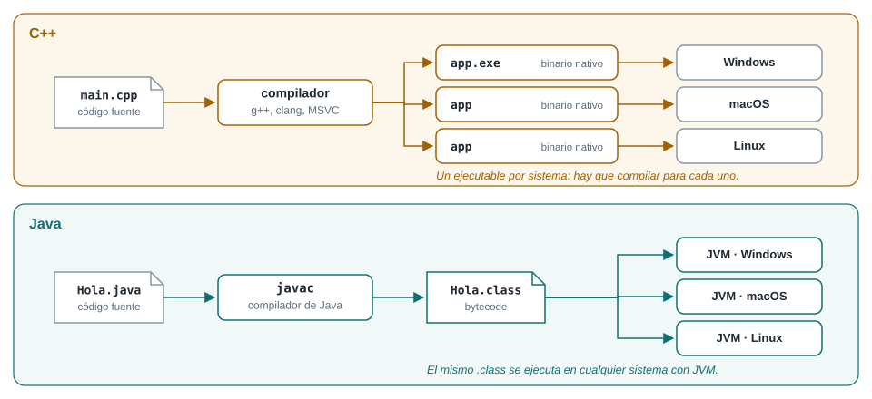
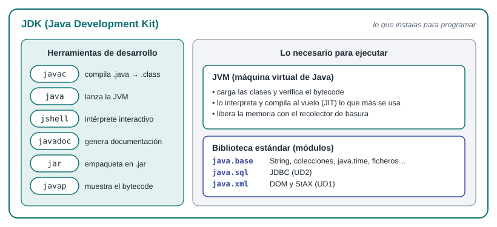
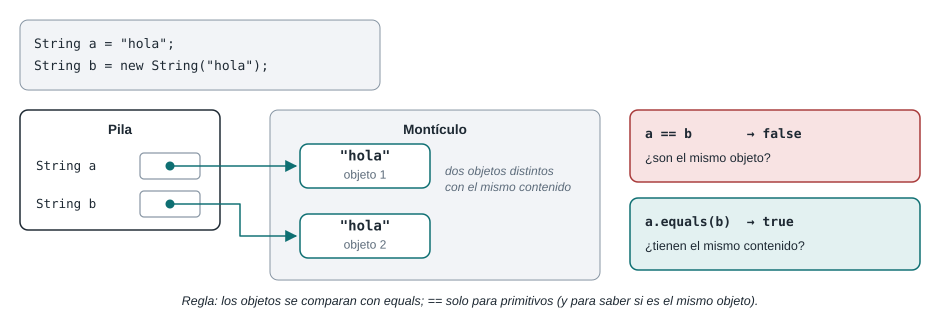

# Unidad Didáctica 0 · Java para quien ya programa en C++
{: .no_toc }

*Acceso a Datos · 2.º DAM · Versión del 01/10/2026*

<details open markdown="block">
  <summary>Contenido de la unidad</summary>
  {: .text-delta }
1. TOC
{:toc}
</details>


## Presentación de la unidad

En esta unidad, de 8 horas, trasladas a Java lo que ya sabes hacer en C++, dejas tu ordenador preparado para todo el curso (JDK 25, VS Code y Gradle) y construyes el esqueleto del proyecto integrador, que irá creciendo unidad a unidad. No partes de cero: el objetivo no es traducir C++ línea a línea, sino entender qué hace Java de otra manera y escribir código Java idiomático.

Es una unidad de nivelación y no tiene criterios de evaluación propios. Aun así, todo lo que ves aquí se usa desde la UD1, y su práctica (el Hito 0 del proyecto integrador) es la base sobre la que trabajarás el resto del curso.

### Para qué sirve cada apartado

| Apartado | Dónde lo vas a necesitar |
|---|---|
| 0.1 y 0.2 · Ecosistema y VS Code | Todo el curso. |
| 0.3 · Gradle | Todas las unidades: cada biblioteca del módulo (Jackson, conectores JDBC, Hibernate, ObjectDB, MongoDB, Spring Boot) entra en el proyecto como una dependencia de Gradle. |
| 0.4 · Sintaxis y tipos | Todo el curso. `BigDecimal` y las fechas de `java.time`, al guardar columnas `DECIMAL` y `DATE` (UD2 y UD3). |
| 0.5 · Clases, records, `equals` y `hashCode` | Colecciones (UD1) y entidades JPA (UD3). |
| 0.6 · Interfaces | El patrón repositorio que recorre el curso (UD1 a UD6) y los componentes de la UD6. |
| 0.7 · Genéricos, colecciones y lambdas | A fondo en la UD1; consultas de MongoDB (UD5) y Spring Data (UD6). |
| 0.8 · Excepciones | CE 1f; `IOException` (UD1) y `SQLException` (UD2). |
| 0.9 · Consola, pruebas y documentación | La interfaz de texto de las UD1 a UD5 y los CE 1g, 4h y 6h («se han probado y documentado…»). |

### Temporalización

| Sesión | Fecha | Horas | Contenidos |
|---|---|---|---|
| 1 | Miércoles 16/09/2026 | 1 | 0.1 Ecosistema e instalación del JDK |
| 2 | Jueves 17/09/2026 | 2 | 0.2 VS Code · 0.3 Gradle |
| 3 | Martes 22/09/2026 | 1 | 0.4 Sintaxis y tipos |
| 4 | Miércoles 23/09/2026 | 1 | 0.5 Clases y objetos |
| 5 | Jueves 24/09/2026 | 2 | 0.6 Herencia e interfaces · 0.7 Genéricos, colecciones y lambdas |
| 6 | Martes 29/09/2026 | 1 | 0.8 Excepciones · 0.9 Consola, pruebas y documentación |

El ritmo es alto porque ya sabes programar. Las sesiones se dedican sobre todo a practicar; la lectura completa de cada apartado y los ejercicios marcados como autónomos se hacen fuera del aula. Si cursas también la optativa de Python, reconocerás el enfoque: es el mismo viaje desde C++, con otro lenguaje de destino.

### Requisitos previos

- Haber superado Programación de 1.º: variables, control de flujo, funciones, vectores, clases y herencia en C++.
- Saber crear un repositorio en GitHub y hacer `commit` y `push` (Entornos de Desarrollo de 1.º).
- Bases de Datos de 1.º: no se usa en esta unidad, pero sí desde la UD2.
- Un ordenador propio con permisos para instalar programas, con Windows, macOS o Linux.

### Convenciones de estos apuntes

- **Listado 0.x**: código completo que puedes copiar y ejecutar. Las líneas que empiezan por `jshell>` son una sesión del intérprete interactivo de Java: escribes lo que va detrás del indicador y la línea siguiente es la respuesta.
- **Windows · macOS y Linux**: cuando una orden cambia según el sistema, verás dos versiones: una para PowerShell y otra para bash o zsh.
- **Desde C++**: comparación directa con lo que ya conoces.
- **Figura 0.x**: esquemas de lo que el código no deja ver (memoria, construcción del proyecto, arquitectura).
- **Para practicar**: ejercicios al final de cada apartado. Los marcados con (A) son autónomos.

---

## 0.1 El ecosistema Java

### Compilar una vez, ejecutar en cualquier sistema

En C++ el compilador traduce tu código a instrucciones de un procesador y un sistema operativo concretos: el ejecutable de Windows no sirve en macOS. Java añade un paso intermedio. El compilador `javac` traduce el código fuente a **bytecode**, un lenguaje máquina de una máquina que no existe físicamente: la **máquina virtual de Java (JVM)**. Cada sistema tiene su propia JVM, y todas entienden el mismo bytecode.



*Figura 0.1. Del código fuente a la ejecución en C++ y en Java.*

En este módulo esto tiene una consecuencia práctica: en clase hay ordenadores con Windows, macOS y Linux, y el mismo proyecto funciona en todos sin tocar nada.

| Aspecto | C++ | Java |
|---|---|---|
| Compilación | A código máquina de una plataforma (g++, clang, MSVC) | A bytecode (`.class`) independiente de la plataforma, con `javac` |
| Ejecución | El sistema operativo ejecuta el binario | La JVM interpreta el bytecode y compila al vuelo (JIT) las partes que más se usan |
| Memoria | Manual o con RAII (`new`/`delete`, punteros inteligentes) | Automática: el recolector de basura libera los objetos que ya nadie usa |
| Punteros | Sí, con aritmética de punteros | No: referencias sin aritmética; usar una referencia `null` lanza `NullPointerException` |
| Herencia | Múltiple | Simple entre clases; múltiple solo de interfaces |
| Errores en ejecución | Muchos son comportamiento indefinido (salirse de un vector, por ejemplo) | Casi todos lanzan una excepción con su traza |
| Construcción y bibliotecas | Make, CMake, vcpkg, Conan | Gradle o Maven, que descargan las bibliotecas de Maven Central |

### Qué hay dentro del JDK

Para programar en Java instalas el **JDK** (*Java Development Kit*). Contiene las herramientas de desarrollo, la JVM y la biblioteca estándar, organizada en módulos. Algunas distribuciones ofrecen también un JRE, que solo sirve para ejecutar; no lo necesitas.



*Figura 0.2. Qué contiene el JDK.*

### Qué versión instalar

Java publica una versión nueva cada seis meses, y cada dos años una de ellas es de soporte a largo plazo (LTS). Usaremos **Java 25**, la LTS más reciente: se publicó el 16 de septiembre de 2025, dos años después de Java 21. Las versiones intermedias, como Java 26, no son LTS.

Hay varias distribuciones del mismo OpenJDK. Usaremos **Eclipse Temurin**, del proyecto Adoptium: es gratuita, de código abierto y está disponible para los tres sistemas.

**Listado 0.1.** Instalación de Temurin 25 en Windows (PowerShell)

```powershell
winget install EclipseAdoptium.Temurin.25.JDK

# Cierra la terminal y abre otra para que se actualice el PATH
java -version
javac -version

# Define JAVA_HOME (la carpeta que contiene bin\java.exe) para tu usuario
$jdk = Split-Path (Split-Path (Get-Command java).Source)
$jdk        # comprueba que la ruta es la de Eclipse Adoptium
[Environment]::SetEnvironmentVariable("JAVA_HOME", $jdk, "User")
```

**Listado 0.2.** Instalación en macOS (Homebrew) y en Linux (bash/zsh)

```bash
# macOS
brew install --cask temurin@25
export JAVA_HOME=$(/usr/libexec/java_home -v 25)      # añádelo a ~/.zshrc

# Ubuntu o Debian
sudo apt install openjdk-25-jdk
export JAVA_HOME=$(dirname $(dirname $(readlink -f $(which java))))   # añádelo a ~/.bashrc

# Cualquier sistema tipo Unix, con SDKMAN! (también fija JAVA_HOME)
curl -s "https://get.sdkman.io" | bash
source "$HOME/.sdkman/bin/sdkman-init.sh"
sdk list java | grep tem            # busca el identificador de Temurin 25 (acaba en -tem)
sdk install java 25.0.x-tem         # sustituye 25.0.x por la versión que aparezca

# Comprobación
java -version
javac -version
```

La primera línea de `java -version` debe empezar por `openjdk version "25`. Si ves otra versión, tienes más de un JDK instalado y el que aparece primero en el `PATH` no es el bueno.

> **Desde C++.** No hay un `g++` distinto por sistema ni opciones de compilación por plataforma. El mismo `javac` y el mismo `.class` sirven en todas partes.

### Cuatro formas de ejecutar Java

**1. jshell, el intérprete interactivo.** Sirve para probar una expresión sin crear ningún fichero. Es la herramienta perfecta para comprobar las diferencias con C++ de este apartado y del 0.4.

```text
jshell> 7 / 2
$1 ==> 3

jshell> "dam".toUpperCase()
$2 ==> "DAM"

jshell> /exit
```

**2. Un fichero fuente suelto.** Desde Java 11, `java Fichero.java` compila en memoria y ejecuta sin dejar ficheros `.class`. Desde Java 25 (JEP 512), además, un programa pequeño no necesita declarar una clase: basta con un método `main` y la clase `IO` para leer y escribir por consola. Los paquetes básicos (`java.util`, `java.time`…) están disponibles sin `import`.

**Listado 0.3.** `Hola.java`: un fichero fuente compacto (Java 25)

```java
void main() {
    String nombre = IO.readln("¿Cómo te llamas? ");
    IO.println("Hola, " + nombre + ". Estás usando Java " + Runtime.version().feature());
    List<String> ciclos = List.of("DAM", "DAW", "ASIR");
    IO.println(ciclos);
}
```

```text
$ java Hola.java
¿Cómo te llamas? Ana
Hola, Ana. Estás usando Java 25
[DAM, DAW, ASIR]
```

**3. Compilar y ejecutar por separado.** Es la forma clásica, la que verás en casi todo el código Java existente: cada clase pública va en un fichero con su mismo nombre y el programa empieza en un método `public static void main(String[] args)`.

**Listado 0.4.** `Saludo.java`: la forma clásica

```java
public class Saludo {

    public static void main(String[] args) {
        System.out.println("Hola desde Java " + Runtime.version().feature());
    }
}
```

```bash
javac Saludo.java      # genera Saludo.class
java Saludo            # se indica la clase, no el fichero
```

**4. Un proyecto de Gradle.** Es como trabajaremos en el módulo y lo verás en el apartado 0.3. Gradle compila, descarga las bibliotecas, pasa las pruebas y ejecuta por ti.

| Forma | Cuándo usarla |
|---|---|
| `jshell` | Probar una expresión o un método de la biblioteca |
| `java Fichero.java` | Programas de un solo fichero, ejercicios rápidos, pequeñas utilidades |
| `javac` + `java` | Entender qué pasa por debajo; casi nunca a mano |
| Proyecto Gradle | Todo lo demás: el proyecto integrador y las prácticas |

> **Desde C++.** `main` no devuelve un `int`: si quieres indicar un código de salida, usa `System.exit(1)`. Los argumentos llegan en `String[] args`, sin `argc`, porque los arrays conocen su longitud (`args.length`).

### Para practicar

1. Instala el JDK 25, comprueba `java -version` y `javac -version` y define `JAVA_HOME`.
2. En `jshell`, predice primero y comprueba después el resultado de `-7 / 2`, `-7 % 2`, `7 / 2.0`, `Integer.MAX_VALUE + 1` y `0.1 + 0.2`. ¿Cuáles darían lo mismo en C++?
3. Crea `Hola.java` (Listado 0.3) y ejecútalo con `java Hola.java`.
4. (A) Compila `Saludo.java` con `javac` y ejecuta `javap -c Saludo`. Localiza en la salida la instrucción que llama a `println`: eso es bytecode.

---

## 0.2 VS Code para Java

Usaremos Visual Studio Code, el mismo editor que ya conoces, con las extensiones de Java. No es un IDE pesado: arranca rápido y funciona igual en los tres sistemas.

### Extensiones

Instala desde la vista de extensiones (Ctrl+Mayús+X, o Cmd+Mayús+X en macOS):

| Extensión | Editor | Para qué |
|---|---|---|
| Extension Pack for Java | Microsoft | Reúne el soporte del lenguaje (de Red Hat), el depurador, el ejecutor de pruebas y el gestor de proyectos |
| Gradle for Java | Microsoft | Importa proyectos de Gradle y añade la vista *Gradle Projects* para lanzar tareas. Si tu versión del pack ya la incluye, aparecerá como instalada |

La primera vez que abras un fichero `.java`, el servidor de lenguaje tarda unos segundos en arrancar; en la barra de estado verás cuándo está listo. Detecta solo los JDK instalados. Para comprobar cuál usa, abre la paleta de órdenes (Ctrl+Mayús+P) y ejecuta **Java: Configure Java Runtime**.

### Ejecutar y depurar

Abre siempre la **carpeta raíz** del proyecto (Archivo → Abrir carpeta), no un fichero suelto: así VS Code reconoce el proyecto de Gradle y sus dependencias.

- Encima de cada método `main` aparecen los enlaces **Run** y **Debug**. Ejecutan el programa en la terminal integrada, así que la lectura por teclado funciona.
- Para depurar, haz clic a la izquierda del número de línea para poner un **punto de ruptura** y pulsa **Debug** (o F5). Con F10 avanzas una línea, con F11 entras en el método y en el panel *Variables* ves el contenido de cada objeto.
- Encima de cada prueba de JUnit (apartado 0.9) aparecen botones para ejecutarla, y la vista **Testing** (el icono del matraz) las muestra todas.
- En la vista **Gradle Projects** (el icono del elefante) tienes todas las tareas del proyecto: doble clic para ejecutar una.

### Órdenes útiles de la paleta

| Orden | Cuándo usarla |
|---|---|
| Java: Configure Java Runtime | Ver qué JDK usa cada proyecto |
| Java: Clean Java Language Server Workspace | VS Code marca errores que no existen, por ejemplo tras cambiar `build.gradle.kts`. Reinicia el análisis desde cero |
| Format Document (Mayús+Alt+F) | Reformatea el fichero. Puedes activarlo al guardar con el ajuste `editor.formatOnSave` |

### Para practicar

1. Instala VS Code y las extensiones. Abre la carpeta de `Saludo.java`, ejecútalo con **Run** y comprueba qué JDK detecta con **Java: Configure Java Runtime**.
2. Pon un punto de ruptura en `Saludo.java`, depura con F5 y observa las variables.
3. (A) Activa `editor.formatOnSave`, desordena la sangría de un fichero y guárdalo.

---

## 0.3 Gradle: construir proyectos Java

### Por qué una herramienta de construcción

En C++ has compilado con `g++` a mano y quizá con un `Makefile` o CMake. Un proyecto Java real tiene decenas de clases, usa bibliotecas externas (en este módulo, conectores de bases de datos, Hibernate, el driver de MongoDB, Spring Boot…), tiene pruebas y hay que empaquetarlo. Hacerlo a mano no es viable.

Una **herramienta de construcción** automatiza todo eso: descarga las bibliotecas y las de las que estas dependen, compila, pasa las pruebas, genera la documentación, empaqueta y ejecuta. En Java hay dos dominantes, Maven y Gradle. Usaremos **Gradle**: es la herramienta de Android (la usa Android Studio, que verás en Programación Multimedia y Dispositivos Móviles), Spring la ofrece por defecto y solo vuelve a hacer el trabajo que ha cambiado desde la última vez.

| Concepto | Qué es | Dónde se ve |
|---|---|---|
| *Build* (construcción) | El proyecto completo de Gradle | `settings.gradle.kts`, en la raíz |
| Proyecto o subproyecto | Una parte del *build* que produce un resultado; `gradle init` crea uno llamado `app` | `app/build.gradle.kts` |
| *Plugin* | Añade tareas y convenciones: `java`, `application`… | Bloque `plugins` |
| Tarea (*task*) | Una unidad de trabajo: `compileJava`, `test`, `jar`, `run` | `./gradlew tasks` |
| Dependencia | Una biblioteca externa, identificada por `grupo:artefacto:versión` | Bloque `dependencies` |
| Repositorio | De dónde se descargan las dependencias; para nosotros, Maven Central | Bloque `repositories` |
| *Wrapper* | Script que descarga y usa la versión exacta de Gradle del proyecto | `gradlew` y `gradlew.bat` |

> **Desde C++.** Gradle hace a la vez el papel de CMake (qué compilar y cómo) y de un gestor de paquetes como vcpkg o Conan (descargar bibliotecas). Las tareas se parecen a los objetivos de un `Makefile`: cada una declara de cuáles depende y solo se ejecuta si sus entradas han cambiado.

### Instalar Gradle (y por qué casi no lo vas a usar)

Gradle es un programa Java: necesita un JDK 17 o posterior, y ya tienes el 25. Lo instalas una vez para **crear** proyectos con `gradle init`. A partir de ahí trabajarás siempre con el *wrapper* (`./gradlew`), que no necesita Gradle instalado.

**Listado 0.5.** Instalación de Gradle en macOS y Linux (bash/zsh)

```bash
# Opción 1, macOS y Linux: SDKMAN! (si lo instalaste con el JDK)
sdk install gradle

# Opción 2, macOS: Homebrew
brew install gradle

gradle --version
```

En Linux evita el paquete de la distribución (`apt install gradle`): la documentación de Gradle advierte de que esos paquetes no los controla Gradle y pueden ser antiguos o estar modificados.

**Listado 0.6.** Instalación manual de Gradle en Windows (PowerShell)

```powershell
# 1. Descarga gradle-9.x.y-bin.zip (la versión más reciente) desde https://gradle.org/releases/
# 2. Descomprímelo en C:\Gradle; quedará la carpeta C:\Gradle\gradle-9.x.y
# 3. Añade su carpeta bin al PATH de tu usuario (ajusta la versión):
$bin = "C:\Gradle\gradle-9.x.y\bin"
$path = [Environment]::GetEnvironmentVariable("Path", "User")
[Environment]::SetEnvironmentVariable("Path", "$path;$bin", "User")

# 4. Abre una terminal nueva y comprueba
gradle --version
```

Si usas el gestor de paquetes Scoop, `scoop install gradle` hace lo mismo.

### Crear el proyecto con `gradle init`

La tarea `init` genera un proyecto completo. Puede hacerte preguntas una a una o recibir todas las respuestas en la orden. Usaremos esta segunda forma para que todos tengamos exactamente lo mismo.

**Listado 0.7.** Creación del proyecto de ejemplo `tienda` (igual en PowerShell, bash y zsh)

```bash
mkdir tienda
cd tienda
gradle init --type java-application --dsl kotlin --test-framework junit-jupiter --package es.dam.tienda --project-name tienda --java-version 25 --no-split-project
```

| Opción | Significado |
|---|---|
| `--type java-application` | Una aplicación Java ejecutable (no una biblioteca) |
| `--dsl kotlin` | Los ficheros de construcción se escriben en Kotlin (`.gradle.kts`). Es el valor por defecto actual y el editor lo autocompleta mejor que Groovy |
| `--test-framework junit-jupiter` | Pruebas con JUnit (apartado 0.9) |
| `--package es.dam.tienda` | Paquete raíz del código; usa el tuyo en tu proyecto |
| `--java-version 25` | Versión de Java del proyecto |
| `--no-split-project` | Un único subproyecto `app`, sin dividirlo en aplicación y biblioteca |

Si aún te pregunta algo (por ejemplo, si quieres usar funciones experimentales), pulsa Intro para aceptar la opción por defecto. El resultado es esta estructura:

```text
tienda/
├── gradle/
│   ├── libs.versions.toml           ← catálogo de versiones de las dependencias
│   └── wrapper/
│       ├── gradle-wrapper.jar
│       └── gradle-wrapper.properties ← versión de Gradle del proyecto
├── gradlew                          ← wrapper para macOS y Linux
├── gradlew.bat                      ← wrapper para Windows
├── settings.gradle.kts              ← nombre del build y subproyectos
└── app/
    ├── build.gradle.kts             ← cómo se construye la aplicación
    └── src/
        ├── main/java/es/dam/tienda/App.java
        └── test/java/es/dam/tienda/AppTest.java
```

Fíjate en que `src/main/java` y `src/test/java` separan el código de la aplicación del de las pruebas, y en que dentro de ellas las carpetas reproducen el paquete (`es/dam/tienda`). Es una convención: si la respetas, Gradle no necesita que le digas dónde está nada.

### Los ficheros de construcción

`gradle init` genera unos ficheros muy parecidos a los siguientes; los comentarios en español son nuestros y hemos hecho dos cambios que se explican después.

**Listado 0.8.** `settings.gradle.kts`

```kotlin
plugins {
    // Permite a Gradle descargar el JDK que pida el toolchain si no está instalado
    id("org.gradle.toolchains.foojay-resolver-convention") version "1.0.0"
}

rootProject.name = "tienda"   // nombre fijo, aunque cambie el de la carpeta
include("app")                // el build tiene un subproyecto: app
```

**Listado 0.9.** `app/build.gradle.kts`

```kotlin
plugins {
    application                      // aplicación ejecutable: incluye el plugin java y añade run
}

repositories {
    mavenCentral()                   // de aquí se descargan las dependencias
}

dependencies {
    testImplementation(libs.junit.jupiter)                          // JUnit, solo para las pruebas
    testRuntimeOnly("org.junit.platform:junit-platform-launcher")   // lo necesita Gradle para lanzarlas
}

java {
    toolchain {
        languageVersion = JavaLanguageVersion.of(25)   // compilar, probar y ejecutar con Java 25
    }
}

application {
    mainClass = "es.dam.tienda.App"  // clase que contiene main
}

tasks.named<Test>("test") {
    useJUnitPlatform()
}

// Conecta el teclado al programa cuando se lanza con ./gradlew run
tasks.named<JavaExec>("run") {
    standardInput = System.`in`
}
```

Los dos cambios respecto a lo que genera `init`:

- **Se ha quitado la dependencia de Guava** (`implementation(libs.guava)`), una biblioteca de Google que `init` añade como ejemplo y que no vamos a usar. Bórrala también del catálogo.
- **Se ha añadido el último bloque.** La tarea `run` lanza el programa con la entrada estándar vacía, así que cualquier lectura con `Scanner` falla con `NoSuchElementException`. Como todas nuestras aplicaciones son de consola, este bloque es imprescindible. El nombre `in` va entre acentos graves porque en Kotlin es una palabra reservada.

El bloque `toolchain` fija la versión de Java del proyecto independientemente del JDK con el que se ejecute Gradle. Si alguien abre el proyecto en un equipo sin Java 25, el plugin de `settings.gradle.kts` lo descarga automáticamente.

### Dependencias y catálogo de versiones

Una dependencia se identifica por tres coordenadas, `grupo:artefacto:versión`, por ejemplo `org.junit.jupiter:junit-jupiter:6.1.1`. Puedes escribirlas directamente en `build.gradle.kts`, pero `gradle init` usa un **catálogo de versiones**: un único fichero con todas las bibliotecas y sus versiones, al que el script se refiere mediante alias.

**Listado 0.10.** `gradle/libs.versions.toml` (sin Guava)

```toml
[versions]
junit-jupiter = "6.1.1"

[libraries]
junit-jupiter = { module = "org.junit.jupiter:junit-jupiter", version.ref = "junit-jupiter" }
```

Cada entrada de `[libraries]` se convierte en un alias que empieza por `libs.`: los guiones pasan a ser puntos, así que `junit-jupiter` se usa como `libs.junit.jupiter`. Cuando en la UD1 necesites Jackson para leer y escribir JSON, añadirás una línea al catálogo y otra a `dependencies`, exactamente igual. La versión que genere tu `gradle init` puede ser otra; lo importante es la estructura.

La palabra que precede a cada dependencia es su **configuración**: indica en qué momento se necesita.

| Configuración | La biblioteca se usa… | Ejemplo en el curso |
|---|---|---|
| `implementation` | Para compilar y ejecutar la aplicación | Jackson (UD1), Hibernate (UD3) |
| `runtimeOnly` | Solo al ejecutar; tu código no la nombra | Conector JDBC de MariaDB (UD2) |
| `compileOnly` | Solo al compilar | Anotaciones de herramientas |
| `testImplementation` | Para compilar y ejecutar las pruebas | JUnit |
| `testRuntimeOnly` | Solo al ejecutar las pruebas | `junit-platform-launcher` |


*Figura 0.3. Cómo resuelve Gradle las dependencias.*

Cada biblioteca puede depender a su vez de otras (**dependencias transitivas**), y Gradle las descarga todas. Con `./gradlew :app:dependencies` ves el árbol completo.

### Tareas

Las tareas se lanzan con el *wrapper*. En PowerShell se escribe `.\gradlew` y en bash o zsh `./gradlew`; el resto de la orden es idéntico.

**Listado 0.11.** Tareas habituales (macOS y Linux; en Windows, `.\gradlew`)

```bash
./gradlew tasks                     # lista las tareas disponibles
./gradlew build                     # compila, pasa las pruebas y empaqueta
./gradlew run -q --console=plain    # ejecuta la aplicación con una salida limpia
./gradlew test                      # solo las pruebas
./gradlew javadoc                   # genera la documentación
./gradlew clean                     # borra la carpeta build
```

Las opciones `-q` (*quiet*) y `--console=plain` eliminan los mensajes y la barra de progreso de Gradle, que en un programa de consola se mezclan con tus menús.

Las tareas forman un grafo: cada una declara de cuáles depende y Gradle las ejecuta en orden. Si una tarea ya se hizo y sus entradas no han cambiado, la marca como `UP-TO-DATE` y se la salta; por eso el segundo `build` es mucho más rápido que el primero.


*Figura 0.4. Las tareas de los plugins `java` y `application` y sus dependencias.*

Todo lo que genera Gradle va a `app/build`:

| Ruta | Contenido |
|---|---|
| `app/build/classes/java/main` | Los `.class` de la aplicación |
| `app/build/libs/app.jar` | La aplicación empaquetada |
| `app/build/reports/tests/test/index.html` | El informe de las pruebas, para abrir en el navegador |
| `app/build/docs/javadoc/index.html` | La documentación |
| `app/build/distributions` | ZIP y TAR con la aplicación, sus bibliotecas y scripts de arranque |

### El *wrapper*

El *wrapper* es la pieza que hace que el proyecto funcione igual en todos los ordenadores. El fichero `gradle-wrapper.properties` guarda qué versión de Gradle usa el proyecto. Cuando ejecutas `./gradlew`, el script comprueba si esa versión está en tu caché y, si no, la descarga una única vez.


*Figura 0.5. Qué ocurre al ejecutar `./gradlew`.*

Ventajas: todo el grupo usa la misma versión de Gradle, nadie necesita instalarlo para trabajar con un proyecto ya creado y el profesor puede corregir tu práctica con la misma versión que usaste tú. Para cambiar de versión, `./gradlew wrapper --gradle-version 9.x.y`.

**Qué se sube al repositorio y qué no.** Sí se suben `gradlew`, `gradlew.bat` y la carpeta `gradle/` completa (incluido `gradle-wrapper.jar`). No se suben las carpetas que se regeneran.

**Listado 0.12.** Líneas mínimas del `.gitignore`

```text
.gradle/
build/
bin/
```

La carpeta `bin/` la crea la extensión de Java de VS Code al compilar por su cuenta. `gradle init` genera un `.gitignore` con las dos primeras; añade la tercera.

En macOS y Linux, si al ejecutar `./gradlew` aparece *permission denied* (pasa al descomprimir un ZIP hecho en Windows), dale permiso de ejecución con `chmod +x gradlew`. Para que el permiso viaje con Git aunque trabajes en Windows: `git update-index --chmod=+x gradlew`.

### Para practicar

1. Instala Gradle y crea el proyecto `tienda` con el Listado 0.7. Ábrelo en VS Code y busca la vista *Gradle Projects*.
2. Aplica los cambios del Listado 0.9, ejecuta `./gradlew build` y localiza el JAR y el informe de pruebas.
3. Ejecuta `./gradlew build` otra vez y explica qué significa `UP-TO-DATE` en las tareas que aparecen.
4. Cambia la prueba `AppTest` para que falle. ¿Qué tarea falla y qué ocurre con `build`?
5. (A) Ejecuta `./gradlew :app:dependencies --configuration testRuntimeClasspath` e identifica qué bibliotecas trae JUnit consigo.
6. (A) Borra el bloque `tasks.named<JavaExec>("run")`, haz que `App` lea una línea con `Scanner` y lánzala con `./gradlew run`. Lee el error y vuelve a poner el bloque.

---

## 0.4 Sintaxis y tipos desde C++

La sintaxis de Java te resultará familiar: llaves, punto y coma, `if`, `for`, `while`, `switch` y operadores casi idénticos. Las diferencias importantes están en los tipos y en cómo se guardan los objetos en memoria.

### Tipos primitivos

| Tipo | Tamaño | Rango o uso | Literal |
|---|---|---|---|
| `byte` | 8 bits | −128 a 127 | `(byte) 10` |
| `short` | 16 bits | −32 768 a 32 767 | `(short) 10` |
| `int` | 32 bits | unos ±2 100 millones | `42`, `1_000_000` |
| `long` | 64 bits | unos ±9,2 × 10¹⁸ | `3_000_000_000L` |
| `float` | 32 bits | coma flotante simple | `1.5f` |
| `double` | 64 bits | coma flotante doble | `1.5`, `2e-3` |
| `char` | 16 bits | un carácter UTF-16 | `'A'`, `'ñ'` |
| `boolean` | — | `true` o `false` | `true` |

> **Desde C++.** Los tamaños son fijos en todas las plataformas: un `int` es siempre de 32 bits. No existen los tipos `unsigned`. `boolean` no es un entero: `if (x)` con un `int` no compila, hay que escribir `if (x != 0)`. Y no hay variables sin inicializar: el compilador no te deja leer una variable local a la que no has dado valor.

La aritmética entera se comporta como en C++: la división trunca hacia cero y el desbordamiento da la vuelta sin avisar. Si necesitas que avise, usa los métodos `Math.addExact`, `Math.multiplyExact`…

**Listado 0.13.** Aritmética en jshell

```text
jshell> 7 / 2
$1 ==> 3

jshell> -7 / 2
$2 ==> -3

jshell> 7 / 2.0
$3 ==> 3.5

jshell> Integer.MAX_VALUE + 1
$4 ==> -2147483648

jshell> Math.addExact(Integer.MAX_VALUE, 1)
|  Exception java.lang.ArithmeticException: integer overflow
|        at Math.addExact (Math.java:915)
|        at (#5:1)
```

Si estás haciendo la optativa de Python, fíjate en que `-7 / 2` da `-3` en Java (como en C++), mientras que `-7 // 2` da `-4` en Python.

### Coma flotante y dinero: `BigDecimal`

`double` tiene los mismos problemas de precisión que en C++, porque 0,1 no tiene representación exacta en binario. Para importes de dinero se usa `BigDecimal`, que guarda números decimales exactos. Es además el tipo que corresponde a las columnas `DECIMAL` de SQL, así que lo usarás en todo el curso.

**Listado 0.14.** `double` frente a `BigDecimal`, y conversiones (continúa la sesión anterior)

```text
jshell> 0.1 + 0.2
$6 ==> 0.30000000000000004

jshell> new java.math.BigDecimal("0.1").add(new java.math.BigDecimal("0.2"))
$7 ==> 0.3

jshell> (int) 3.99
$8 ==> 3

jshell> Integer.parseInt("42") + 1
$9 ==> 43

jshell> Integer.parseInt("4,2")
|  Exception java.lang.NumberFormatException: For input string: "4,2"
|        at NumberFormatException.forInputString (NumberFormatException.java:67)
|        at Integer.parseInt (Integer.java:565)
|        at Integer.parseInt (Integer.java:662)
|        at (#10:1)
```

Tres reglas sobre `BigDecimal`: créalo siempre a partir de un `String` (`new BigDecimal("0.1")`), porque `new BigDecimal(0.1)` hereda el error del `double`; opera con métodos (`add`, `subtract`, `multiply`), porque no tiene operadores; y compara importes con `compareTo`, no con `equals`, porque `equals` considera distintos `2.0` y `2.00`.

Las conversiones que pueden perder información, como de `double` a `int`, necesitan un *cast* explícito. Para convertir texto en número se usan `Integer.parseInt`, `Double.parseDouble` o `new BigDecimal(texto)`; si el texto no es un número válido, lanzan `NumberFormatException`.

### `var` y `final`

Dentro de un método puedes dejar que el compilador deduzca el tipo con `var`, como `auto` en C++. Úsalo cuando el tipo ya se lee en la misma línea:

```java
var productos = new ArrayList<Producto>();   // el tipo es evidente
var total = calcularTotal(pedido);           // ¿qué devuelve? Mejor escribir el tipo
```

`final` equivale a `const` en una variable: no puede reasignarse. Las constantes de clase se declaran `static final` y se escriben en mayúsculas: `static final int MAX_LINEAS = 50;`.

### Variables, objetos y memoria

Esta es la diferencia de fondo entre Java y C++. En Java hay dos clases de variables:

- Las de **tipo primitivo** guardan el valor directamente.
- Las de **cualquier otro tipo** (clases, arrays, `String`…) guardan una **referencia** a un objeto. Los objetos se crean siempre con `new` y viven en el **montículo** (*heap*); nunca en la pila.

Asignar una referencia a otra no copia el objeto: hace que las dos apunten al mismo. Y cuando un objeto se queda sin ninguna referencia, el **recolector de basura** lo libera cuando lo considere oportuno. No hay `delete`.


*Figura 0.6. Variables en la pila y objetos en el montículo.*

Los parámetros se pasan **siempre por valor**. Con un primitivo se copia el valor; con un objeto se copia la referencia. Por eso un método puede modificar el objeto que recibe, pero no puede hacer que la variable del que lo llama apunte a otro objeto.

**Listado 0.15.** `Referencias.java`: alias y paso de parámetros

```java
import java.util.Arrays;

public class Referencias {

    static void duplicar(int[] valores) {        // modifica el objeto recibido
        for (int i = 0; i < valores.length; i++) {
            valores[i] *= 2;
        }
    }

    static void reasignar(int[] valores) {       // solo cambia la copia local de la referencia
        valores = new int[] {0};
    }

    public static void main(String[] args) {
        int[] datos = {1, 2, 3};
        int[] alias = datos;                     // dos referencias, UN solo array
        alias[0] = 99;
        System.out.println(Arrays.toString(datos));   // [99, 2, 3]

        duplicar(datos);
        System.out.println(Arrays.toString(datos));   // [198, 4, 6]

        reasignar(datos);
        System.out.println(Arrays.toString(datos));   // [198, 4, 6]
    }
}
```

> **Desde C++.** No hay punteros ni referencias `&`, ni objetos en la pila: `Producto p;` solo declara una referencia, que vale `null` hasta que le asignas un `new Producto(…)`. Una referencia de Java se parece a un puntero que no admite aritmética y que el lenguaje comprueba: usar una que vale `null` lanza `NullPointerException` en lugar de provocar un comportamiento indefinido.

### Cadenas

`String` es una clase, y sus objetos son **inmutables**: los métodos que parecen modificarla (`toUpperCase`, `replace`, `strip`…) devuelven una cadena nueva.

| Método | Ejemplo | Resultado |
|---|---|---|
| `length()` | `"Ratón".length()` | `5` |
| `charAt(i)` | `"Ratón".charAt(3)` | `'ó'` |
| `substring(i, j)` | `"Ratón".substring(1, 3)` | `"at"` |
| `indexOf(x)` | `"Ratón".indexOf('t')` | `2` (o `-1` si no está) |
| `contains`, `startsWith`, `endsWith` | `"TEC01".startsWith("TEC")` | `true` |
| `strip()`, `isBlank()` | `"  hola  ".strip()` | `"hola"` |
| `split(sep)` | `"a;b;;c".split(";")` | 4 elementos: `a`, `b`, vacío y `c` |
| `String.join` | `String.join(", ", "DAM", "DAW")` | `"DAM, DAW"` |
| `repeat(n)` | `"ab".repeat(3)` | `"ababab"` |
| `formatted(…)` | `"%-8s%6.2f".formatted("Teclado", 59.9)` | `"Teclado  59.90"` (según la configuración regional; ver 0.9) |

Concatenar con `+` está bien en una expresión; dentro de un bucle largo usa `StringBuilder`, que sí es modificable.

Para textos de varias líneas existen los **bloques de texto** (`"""`). Los usarás en la UD2 para escribir sentencias SQL legibles:

```java
String sql = """
        SELECT codigo, nombre, precio
        FROM producto
        WHERE precio > ?
        ORDER BY nombre
        """;
```

La sangría común a todas las líneas se elimina, y el salto de línea final se conserva si las comillas de cierre van en su propia línea.

**Comparar cadenas.** Como `String` es un objeto, `==` compara referencias: dice si dos variables apuntan al **mismo objeto**, no si tienen el mismo texto. Para comparar el contenido se usa `equals` (o `equalsIgnoreCase`).



*Figura 0.7. `==` frente a `equals`.*

Con dos literales iguales, `"hola" == "hola"` puede dar `true` porque Java reutiliza los literales. No te fíes: es una casualidad de la implementación y es la causa de errores muy difíciles de encontrar.

> **Desde C++.** `std::string` es modificable y su `==` compara el contenido. En Java, `String` es inmutable y `==` compara referencias.

### Arrays

```java
int[] notas = new int[5];            // cinco ceros: los arrays se inicializan siempre
int[] dias = {31, 28, 31, 30};
double[][] matriz = new double[3][4];

System.out.println(notas.length);    // 5: length es un atributo, sin paréntesis
System.out.println(Arrays.toString(dias));   // [31, 28, 31, 30]
Arrays.sort(dias);
dias[4] = 31;                        // ArrayIndexOutOfBoundsException: Index 4 out of bounds for length 4
```

Los arrays tienen tamaño fijo y comprueban los índices. Cuando necesites una lista que crezca, usarás `ArrayList` (apartado 0.7).

### Fechas con `java.time`

Para fechas se usa el paquete `java.time`. `LocalDate` representa una fecha sin hora, y es el tipo que corresponde a las columnas `DATE` de SQL. Sus objetos también son inmutables.

**Listado 0.16.** `Fechas.java`

```java
import java.time.LocalDate;
import java.time.Period;
import java.time.format.DateTimeFormatter;
import java.time.temporal.ChronoUnit;

public class Fechas {
    public static void main(String[] args) {
        LocalDate alta = LocalDate.of(2026, 9, 16);
        LocalDate entrega = LocalDate.parse("2026-10-06");            // formato ISO: aaaa-mm-dd
        System.out.println(alta.plusDays(30));                         // 2026-10-16
        System.out.println(ChronoUnit.DAYS.between(alta, entrega));    // 20
        System.out.println(Period.between(LocalDate.of(2007, 3, 15), alta).getYears());   // 19

        var formatoEs = DateTimeFormatter.ofPattern("dd/MM/yyyy");
        System.out.println(alta.format(formatoEs));                    // 16/09/2026
        System.out.println(LocalDate.parse("06/10/2026", formatoEs).getDayOfWeek());   // TUESDAY
    }
}
```

Hay también `LocalTime` (hora), `LocalDateTime` (fecha y hora) e `Instant` (un instante exacto). Olvida las clases antiguas `Date` y `Calendar`: solo las verás en código heredado.

### Control de flujo

`if`, `while`, `do-while`, `for`, `break`, `continue` y el operador ternario son iguales que en C++. Hay un `for` para recorrer arrays y colecciones, como el `for` de rango de C++:

```java
for (int dia : dias) {
    System.out.println(dia);
}
```

El `switch` clásico con `case … :` y `break` sigue existiendo, pero el moderno es más seguro: con `->` no hay caída de un caso al siguiente, admite varias etiquetas por caso y puede devolver un valor. Funciona con enteros, `String` y enumerados.

**Listado 0.17.** `switch` como expresión

```java
int dia = 6;
String tipo = switch (dia) {
    case 1, 2, 3, 4, 5 -> "laborable";
    case 6, 7 -> "fin de semana";
    default -> throw new IllegalArgumentException("Día no válido: " + dia);
};
System.out.println(tipo);   // fin de semana
```

### Para practicar

1. En `jshell`, comprueba qué ocurre con `(byte) 200`, con `'A' + 1` y con `(char) ('A' + 1)`. Explica cada resultado.
2. Escribe un programa que sume 0,1 diez veces con `double` y con `BigDecimal` y muestre los dos resultados.
3. Pide un número por teclado, conviértelo con `Integer.parseInt` y comprueba qué pasa si escribes `12a`.
4. Escribe un método `static String invertir(String s)` con `StringBuilder` y otro que cuente las vocales de una cadena con un `switch` moderno.
5. Calcula cuántos días faltan desde hoy (`LocalDate.now()`) hasta el 22 de diciembre de 2026.
6. (A) Modifica el Listado 0.15 para que `reasignar` sí cambie el array del que llama. Pista: no puede hacerlo con un parámetro; tiene que devolver algo.

---

## 0.5 Clases y objetos

### Anatomía de una clase

Esta es la clase `Producto` del proyecto de ejemplo. Léela entera antes de seguir: casi todo lo que explica este apartado está en ella.

**Listado 0.18.** `modelo/Producto.java`

```java
package es.dam.tienda.modelo;

import java.math.BigDecimal;

/**
 * Producto del catálogo de la tienda.
 * Dos productos son iguales si tienen el mismo código.
 */
public class Producto {

    private final String codigo;          // no cambia una vez creado
    private String nombre;
    private BigDecimal precio;
    private int stock;

    public Producto(String codigo, String nombre, BigDecimal precio, int stock) {
        if (codigo == null || codigo.isBlank()) {
            throw new IllegalArgumentException("El código es obligatorio");
        }
        if (stock < 0) {
            throw new IllegalArgumentException("Stock no válido: " + stock);
        }
        this.codigo = codigo;
        this.nombre = nombre;
        this.precio = validarPrecio(precio);
        this.stock = stock;
    }

    /** Crea un producto sin existencias. */
    public Producto(String codigo, String nombre, BigDecimal precio) {
        this(codigo, nombre, precio, 0);  // delega en el otro constructor
    }

    private static BigDecimal validarPrecio(BigDecimal precio) {
        if (precio == null || precio.signum() < 0) {
            throw new IllegalArgumentException("Precio no válido: " + precio);
        }
        return precio;
    }

    public String getCodigo() { return codigo; }

    public String getNombre() { return nombre; }

    public void setNombre(String nombre) { this.nombre = nombre; }

    public BigDecimal getPrecio() { return precio; }

    public void setPrecio(BigDecimal precio) { this.precio = validarPrecio(precio); }

    public int getStock() { return stock; }

    /** Suma unidades al stock. */
    public void reponer(int unidades) {
        if (unidades <= 0) {
            throw new IllegalArgumentException("Las unidades deben ser positivas");
        }
        stock += unidades;
    }

    @Override
    public boolean equals(Object o) {
        if (this == o) return true;
        if (!(o instanceof Producto otro)) return false;
        return codigo.equals(otro.codigo);
    }

    @Override
    public int hashCode() {
        return codigo.hashCode();
    }

    @Override
    public String toString() {
        return "Producto[" + codigo + ", " + nombre + ", " + precio + " €, stock " + stock + "]";
    }
}
```

Lo que debes observar:

- **Los atributos son privados** y se accede a ellos con métodos `getX` y `setX`. No es burocracia: los *setters* validan, y bibliotecas que usarás (Jackson en la UD1, Hibernate en la UD3) siguen esta convención de nombres para leer y escribir objetos.
- **`codigo` es `final`**: se asigna en el constructor y ya no cambia. Por eso no tiene *setter*.
- **El constructor valida** y, si los datos no son válidos, lanza una excepción. Un objeto que existe es siempre un objeto correcto.
- **`this(…)` delega en otro constructor.** Java no tiene parámetros con valor por defecto; se resuelve sobrecargando constructores o métodos.
- **`@Override`** indica que el método redefine uno heredado. Es opcional, pero si te equivocas en el nombre o en los parámetros, el compilador te avisa.

En los diagramas de clases de estos apuntes, y en los que tendrás que dibujar, una clase se representa así:


*Figura 0.8. Notación UML de una clase.*

| Modificador | Visible desde | UML |
|---|---|---|
| `public` | Cualquier clase | `+` |
| `protected` | El mismo paquete y las subclases | `#` |
| *(ninguno)* | Solo el mismo paquete | `~` |
| `private` | Solo la propia clase | `-` |

> **Desde C++.** No hay ficheros de cabecera: la clase se declara y se implementa en un único `.java`. No hay secciones `public:` y `private:`: cada miembro lleva su propio modificador, y si no lleva ninguno es visible en todo el paquete (no es privado, como en C++). Tampoco hay sobrecarga de operadores ni destructores.

### Paquetes

Un **paquete** agrupa clases relacionadas, como un `namespace`, pero además se corresponde con una carpeta. Por convención se nombran con un dominio al revés: la clase `es.dam.tienda.modelo.Producto` está en `src/main/java/es/dam/tienda/modelo/Producto.java`. Para usar una clase de otro paquete se importa (`import es.dam.tienda.modelo.Producto;`). Las del paquete `java.lang` (`String`, `Math`, `Integer`…) no necesitan `import`.

### Miembros `static`

Un atributo o método `static` pertenece a la clase, no a cada objeto: se usa sin crear ninguno (`Math.max(a, b)`, `Integer.parseInt("42")`). `validarPrecio` es `static` porque no usa ningún atributo del objeto. `main` es `static` porque la JVM lo llama antes de que exista ningún objeto.

### Ciclo de vida de un objeto

Un objeto se crea con `new`, que reserva memoria en el montículo y ejecuta el constructor. No hay forma de destruirlo: cuando deja de haber referencias a él, el recolector de basura recupera su memoria (Figura 0.6). Eso funciona para la memoria, pero no para otros **recursos**: un fichero abierto, una conexión a una base de datos. Esos hay que cerrarlos explícitamente, y en el apartado 0.8 verás la construcción que lo hace por ti, `try-with-resources`. En este módulo es crucial: dejar conexiones abiertas es uno de los errores más típicos del acceso a datos.

### `equals`, `hashCode` y `toString`

Todas las clases heredan de `Object` tres métodos que casi siempre conviene redefinir:

| Método | Por defecto | Redefinido en `Producto` |
|---|---|---|
| `toString()` | `Producto@1b6d3586` (clase y un número) | Una descripción legible; lo usan `println` y el depurador |
| `equals(Object)` | `true` solo si es el mismo objeto (como `==`) | `true` si tienen el mismo código |
| `hashCode()` | Un número distinto para cada objeto | Calculado a partir del código |

`equals` y `hashCode` van siempre juntos, porque las colecciones como `HashSet` y `HashMap` usan los dos: primero el `hashCode` para saber dónde buscar y después `equals` para confirmar. La regla es que **si dos objetos son iguales según `equals`, deben tener el mismo `hashCode`**. Si redefines solo uno, las colecciones se comportan de forma imprevisible.

**Listado 0.19.** Un `HashSet` con objetos sin `equals` ni `hashCode`

```java
import java.util.HashSet;
import java.util.Set;

public class Igualdad {

    static class ProductoSinEquals {
        final String codigo;
        ProductoSinEquals(String codigo) { this.codigo = codigo; }
    }

    public static void main(String[] args) {
        Set<ProductoSinEquals> conjunto = new HashSet<>();
        conjunto.add(new ProductoSinEquals("TEC01"));
        conjunto.add(new ProductoSinEquals("TEC01"));
        System.out.println(conjunto.size());     // 2: para Java son objetos distintos
    }
}
```

Con la clase `Producto` del Listado 0.18, el mismo experimento da `1`. Esto volverá con fuerza en la UD3: Hibernate necesita saber cuándo dos objetos representan la misma fila de la base de datos.

### Records: clases de datos inmutables

Muchas clases solo transportan datos que no cambian. Para ellas Java tiene los **records**: en una línea declaras los componentes y el compilador genera el constructor, los métodos de acceso, `equals`, `hashCode` y `toString`. Todos los atributos son `final`.

**Listado 0.20.** `modelo/Categoria.java` y `modelo/LineaPedido.java`

```java
package es.dam.tienda.modelo;

/** Categoría de productos. Inmutable. */
public record Categoria(int id, String nombre) {
}
```

```java
package es.dam.tienda.modelo;

import java.math.BigDecimal;

/** Una línea de un pedido: qué producto, cuántas unidades y a qué precio. */
public record LineaPedido(Producto producto, int cantidad, BigDecimal precioUnitario) {

    public LineaPedido {                          // constructor compacto: solo validaciones
        if (cantidad <= 0) {
            throw new IllegalArgumentException("Cantidad no válida: " + cantidad);
        }
    }

    public BigDecimal importe() {
        return precioUnitario.multiply(BigDecimal.valueOf(cantidad));
    }
}
```

```text
jshell> record Categoria(int id, String nombre) {}
|  created record Categoria

jshell> var c = new Categoria(1, "Periféricos")
c ==> Categoria[id=1, nombre=Periféricos]

jshell> c.nombre()
$3 ==> "Periféricos"
```

Los métodos de acceso se llaman como el componente, sin `get`: `c.nombre()`, no `c.getNombre()`.

| Usa un `record` para… | Usa una clase para… |
|---|---|
| Datos que no cambian: valores, resultados de una consulta, objetos que se leen de un fichero o se envían por una API | Objetos cuyo estado cambia (el stock de un producto, el estado de un pedido) |
| Igualdad por todos los componentes | Igualdad por un identificador |
| | Las entidades de JPA (UD3): Hibernate necesita poder modificarlas |

### Enumerados

Un `enum` define un tipo con un conjunto cerrado de valores. A diferencia de C++, en Java es una clase completa: puede tener atributos, constructores y métodos.

**Listado 0.21.** `modelo/EstadoPedido.java`

```java
package es.dam.tienda.modelo;

/** Estados por los que pasa un pedido. */
public enum EstadoPedido {
    PENDIENTE, PAGADO, ENVIADO, ENTREGADO, CANCELADO;

    /** Un pedido entregado o cancelado ya no puede cambiar de estado. */
    public boolean esFinal() {
        return this == ENTREGADO || this == CANCELADO;
    }
}
```

| Expresión | Resultado |
|---|---|
| `EstadoPedido.valueOf("PAGADO")` | La constante `PAGADO`; si el texto no coincide, `IllegalArgumentException` |
| `EstadoPedido.PAGADO.name()` | `"PAGADO"` |
| `EstadoPedido.values()` | Array con las cinco constantes, en orden |
| `EstadoPedido.ENVIADO.ordinal()` | `2`, su posición |

Los enumerados se comparan con `==` sin problema, porque cada constante es un único objeto. Cuando guardes un enumerado en un fichero o en una base de datos, usa `name()`, nunca `ordinal()`: si algún día añades un estado en medio, los números guardados dejarían de corresponder.

### Para practicar

1. Escribe la clase `Cliente` (id, nombre, email y fecha de alta) con constructor que valide que el email contiene `@`, *getters*, `equals` y `hashCode` por `id`, y `toString`.
2. Comprueba con un `HashSet` que dos clientes con el mismo `id` cuentan como uno solo. Después borra `hashCode` y repite la prueba.
3. Convierte `Categoria` en una clase normal y compara cuántas líneas necesitas para lo mismo que hace el `record`.
4. Añade a `EstadoPedido` un método `EstadoPedido siguiente()` que devuelva el estado al que se pasa (PENDIENTE → PAGADO → ENVIADO → ENTREGADO) y lance `IllegalStateException` desde un estado final.
5. (A) Dibuja el diagrama UML de `Cliente` con la notación de la Figura 0.8.

---

## 0.6 Herencia, interfaces y polimorfismo

### Cómo se dibujan las relaciones entre clases

A partir de aquí verás muchos diagramas de clases, y en la UD2 los convertirás en tablas. Estas son las cinco relaciones que vas a encontrar:


*Figura 0.9. Relaciones en un diagrama de clases UML.*

Las **multiplicidades** (`1`, `*`, `1..*`, `0..1`) indican cuántos objetos participan en cada extremo: un pedido tiene un cliente; un cliente, muchos pedidos. Son las mismas cardinalidades 1:N y N:M que conoces de los diagramas entidad-relación de Bases de Datos.

### Herencia

Una clase hereda de otra con `extends`. Como ejemplo usaremos las formas de pago de la tienda: todas tienen un titular y calculan una comisión, pero cada una a su manera. `MetodoPago` es **abstracta**: no se pueden crear objetos de ella, solo de sus subclases, y declara un método sin cuerpo que cada subclase debe implementar.

**Listado 0.22.** Una jerarquía de formas de pago

```java
public abstract class MetodoPago {

    private final String titular;

    protected MetodoPago(String titular) {
        this.titular = titular;
    }

    public String getTitular() {
        return titular;
    }

    /** Cada forma de pago calcula su propia comisión. */
    public abstract BigDecimal comision(BigDecimal importe);
}

public class Tarjeta extends MetodoPago {

    private final String ultimosDigitos;

    public Tarjeta(String titular, String ultimosDigitos) {
        super(titular);                       // primero se construye la parte heredada
        this.ultimosDigitos = ultimosDigitos;
    }

    @Override
    public BigDecimal comision(BigDecimal importe) {
        return importe.multiply(new BigDecimal("0.015")).setScale(2, RoundingMode.HALF_UP);
    }
}

public class Bizum extends MetodoPago {

    public Bizum(String titular) {
        super(titular);
    }

    @Override
    public BigDecimal comision(BigDecimal importe) {
        return BigDecimal.ZERO.setScale(2);
    }
}
```

```java
List<MetodoPago> metodos = List.of(new Tarjeta("Ana", "4242"), new Bizum("Luis"));
BigDecimal importe = new BigDecimal("80.00");
for (MetodoPago m : metodos) {
    System.out.println(m.getTitular() + ": " + m.comision(importe));   // Ana: 1.20 / Luis: 0.00
}
```

El bucle no sabe qué tipo de pago tiene cada elemento: llama a `comision` y la JVM ejecuta la versión de la clase real del objeto. Eso es el **polimorfismo**. (`setScale(2, RoundingMode.HALF_UP)` redondea a céntimos; en un programa real cada clase iría en su propio fichero.)

> **Desde C++.** No existe la palabra `virtual`: **todos** los métodos de instancia se resuelven en tiempo de ejecución. Para impedir que una subclase redefina un método, se marca como `final`. Un método `abstract` es lo que en C++ llamas virtual puro (`= 0`). La llamada al constructor de la superclase, `super(…)`, va como primera instrucción del constructor, no en una lista de inicialización. Y solo se puede heredar de una clase.

Todas las clases heredan, directa o indirectamente, de `Object`. Por eso cualquier objeto tiene `toString`, `equals` y `hashCode`.

### Interfaces

Una **interfaz** declara qué operaciones ofrece un tipo sin decir cómo se hacen. Una clase puede implementar todas las interfaces que quiera, y una interfaz puede incluir métodos `default` con una implementación común.

La interfaz más importante del curso es esta. Define qué se puede hacer con los productos guardados (darlos de alta, buscarlos, listarlos, borrarlos) sin decir dónde se guardan.

**Listado 0.23.** `repositorio/ProductoRepository.java`

```java
package es.dam.tienda.repositorio;

import es.dam.tienda.modelo.Producto;
import java.util.List;
import java.util.Optional;

public interface ProductoRepository {

    void guardar(Producto producto);                     // alta, o reemplazo si el código ya existe

    Optional<Producto> buscarPorCodigo(String codigo);   // Optional: ver apartado 0.7

    List<Producto> buscarTodos();

    boolean borrar(String codigo);                       // true si existía

    default boolean existe(String codigo) {
        return buscarPorCodigo(codigo).isPresent();
    }
}
```

El resto del programa trabaja con `ProductoRepository`, nunca con una clase concreta. En esta unidad la implementarás guardando los productos en memoria; en cada unidad siguiente escribirás otra implementación que los guarde en un sitio distinto, **sin cambiar ni una línea del resto del programa**. Ese es el hilo conductor del módulo.


*Figura 0.10. Una interfaz y una implementación por unidad: el mapa del curso.*

| | Clase abstracta | Interfaz |
|---|---|---|
| Atributos de instancia | Sí | No (solo constantes) |
| Constructores | Sí | No |
| Una clase puede heredar o implementar… | Solo una | Todas las que quiera |
| Úsala cuando… | Las subclases comparten estado y código | Quieres definir un contrato que cumplirán clases muy distintas |

### Interfaces selladas, records y `switch` con patrones

Java moderno ofrece otra forma de modelar «un pago es una tarjeta, un Bizum o una transferencia». Una interfaz **sellada** (`sealed`) enumera exactamente qué tipos la implementan, y un `switch` puede distinguir el tipo real de cada objeto:

**Listado 0.24.** Las formas de pago con una interfaz sellada

```java
public sealed interface Pago permits PagoTarjeta, PagoBizum, PagoTransferencia {}

public record PagoTarjeta(String titular, String ultimosDigitos) implements Pago {}
public record PagoBizum(String telefono) implements Pago {}
public record PagoTransferencia(String iban) implements Pago {}
```

```java
static BigDecimal comision(Pago pago, BigDecimal importe) {
    return switch (pago) {
        case PagoTarjeta t -> importe.multiply(new BigDecimal("0.015")).setScale(2, RoundingMode.HALF_UP);
        case PagoBizum _ -> BigDecimal.ZERO.setScale(2);
        case PagoTransferencia _ -> new BigDecimal("0.50");
    };   // sin default: el compilador sabe que no hay más casos
}
```

`case PagoTarjeta t` comprueba el tipo y, si coincide, deja el objeto en la variable `t` ya convertido. El guion bajo indica que no se va a usar la variable. Si mañana añades `PagoEfectivo` a la lista de `permits`, el compilador te señalará este `switch` hasta que trates el caso nuevo.

Las dos versiones son válidas. La herencia clásica reparte el comportamiento entre las clases; la sellada lo concentra en un `switch` y encaja bien con datos inmutables. Lo importante es reconocer ambas cuando las encuentres.

### Para practicar

1. Añade a la jerarquía del Listado 0.22 una clase `Transferencia` con una comisión fija de 0,50 € y pruébala en el bucle.
2. Intenta crear un `new MetodoPago("Ana")`. Lee el error del compilador.
3. Añade a `Tarjeta` un método `public String tostring()` (con la *s* en minúscula) sin `@Override` e imprime una tarjeta con `println`. ¿Se usa tu método? Ponle `@Override` y compila de nuevo.
4. Añade `PagoEfectivo` a `permits` en el Listado 0.24 sin tocar el `switch` y lee el error.
5. (A) Dibuja el diagrama de clases del Listado 0.22 con la notación de la Figura 0.9.

---

## 0.7 Genéricos, colecciones y lambdas

Este apartado es un primer contacto. En la UD1 trabajarás las colecciones a fondo; aquí necesitas lo justo para escribir el Hito 0.

### Genéricos

Una clase o un método genérico recibe tipos como parámetro: `List<String>` es una lista de cadenas y el compilador impide meter en ella otra cosa. Los parámetros de tipo solo admiten clases, no primitivos, así que para guardar números se usan las clases envoltorio (`Integer`, `Long`, `Double`, `Boolean`…). Java convierte automáticamente entre `int` e `Integer` (*autoboxing*).

**Listado 0.25.** Un método genérico

```java
static <T extends Comparable<T>> T maximo(List<T> lista) {
    T mayor = lista.getFirst();
    for (T elemento : lista) {
        if (elemento.compareTo(mayor) > 0) {
            mayor = elemento;
        }
    }
    return mayor;
}

maximo(List.of(3, 17, 8));               // 17
maximo(List.of("pera", "uva", "kiwi"));  // "uva"
```

`<T extends Comparable<T>>` exige que el tipo sepa compararse consigo mismo; es parecido a un *concept* de C++20.

> **Desde C++.** Las plantillas generan una versión del código para cada tipo. Los genéricos de Java se comprueban al compilar y después se **borran**: en ejecución solo existe una `List`, sin saber de qué. Por eso no se puede hacer `new T()` ni `List<int>`.

Cuidado con los envoltorios: son objetos, así que `==` compara referencias. `Integer a = 127, b = 127;` da `a == b` verdadero, pero con 128 da falso, porque Java solo reutiliza los objetos de −128 a 127. Compara siempre con `equals`.

### Colecciones básicas

| C++ (STL) | Java | Características |
|---|---|---|
| `std::vector` | `ArrayList` | Lista con acceso por posición |
| `std::list` | `LinkedList` | Lista enlazada |
| `std::unordered_set` | `HashSet` | Sin repetidos, sin orden |
| `std::set` | `TreeSet` | Sin repetidos, ordenado |
| `std::unordered_map` | `HashMap` | Pares clave-valor, sin orden |
| `std::map` | `TreeMap` | Pares clave-valor, ordenados por clave |
| — | `LinkedHashMap` | Pares clave-valor en orden de inserción |

Declara las variables con la **interfaz** y crea el objeto con la **implementación**: `List<Producto> lista = new ArrayList<>();`. Así podrás cambiar de implementación sin tocar el resto del código; es la misma idea que el repositorio del apartado anterior.

`List.of(…)`, `Set.of(…)` y `Map.of(…)` crean colecciones **inmodificables**: si intentas añadir algo, lanzan `UnsupportedOperationException`.

Con un `Map` ya puedes escribir la primera implementación del repositorio:

**Listado 0.26.** `repositorio/ProductoRepositoryMemoria.java`

```java
package es.dam.tienda.repositorio;

import es.dam.tienda.modelo.Producto;
import java.util.LinkedHashMap;
import java.util.List;
import java.util.Map;
import java.util.Optional;

/** Implementación en memoria: los datos se pierden al cerrar el programa. */
public class ProductoRepositoryMemoria implements ProductoRepository {

    private final Map<String, Producto> productos = new LinkedHashMap<>();

    @Override
    public void guardar(Producto producto) {
        productos.put(producto.getCodigo(), producto);
    }

    @Override
    public Optional<Producto> buscarPorCodigo(String codigo) {
        return Optional.ofNullable(productos.get(codigo));
    }

    @Override
    public List<Producto> buscarTodos() {
        return List.copyOf(productos.values());
    }

    @Override
    public boolean borrar(String codigo) {
        return productos.remove(codigo) != null;
    }
}
```

`buscarTodos` devuelve una **copia** inmodificable: quien la reciba no puede alterar el contenido del repositorio por accidente.

### `Optional`: cuando puede no haber resultado

`productos.get(codigo)` devuelve `null` si el código no existe, y un `null` olvidado acaba en `NullPointerException`. Por eso los métodos de búsqueda devuelven `Optional<Producto>`: una caja que puede contener un producto o estar vacía, y que obliga a quien la recibe a decidir qué hacer en cada caso.

```java
Optional<Producto> resultado = repositorio.buscarPorCodigo("RAT01");

resultado.ifPresentOrElse(
        p -> System.out.println("Encontrado: " + p.getNombre()),
        () -> System.out.println("No existe"));

String nombre = repositorio.buscarPorCodigo("XX")
        .map(Producto::getNombre)
        .orElse("(sin nombre)");

Producto p = repositorio.buscarPorCodigo("TEC01")
        .orElseThrow(() -> new ProductoNoEncontradoException("TEC01"));
```

### Lambdas y referencias a métodos

Una **lambda** es una función sin nombre que se pasa como argumento: `p -> p.getStock() == 0` recibe un producto y devuelve un `boolean`. Cuando la lambda solo llama a un método existente, se escribe más corta como **referencia a método**: `Producto::getNombre`, `System.out::println`.

```java
productos.sort(Comparator.comparing(Producto::getPrecio));   // de más barato a más caro
productos.removeIf(p -> p.getStock() == 0);                  // quita los agotados
productos.forEach(System.out::println);
```

> **Desde C++.** `[&](const Producto& p) { return p.stock == 0; }` se escribe `p -> p.getStock() == 0`. No hay lista de captura: la lambda puede usar variables locales del método siempre que no se modifiquen después (*effectively final*).

### *Streams*: un primer vistazo

Un *stream* encadena operaciones sobre los elementos de una colección sin escribir el bucle. Las verás a fondo en la UD1; de momento, reconoce la forma:

**Listado 0.27.** Dos consultas sobre una lista de productos

```java
List<String> agotados = productos.stream()
        .filter(p -> p.getStock() == 0)       // quédate con los que cumplen
        .map(Producto::getNombre)             // transforma cada uno
        .toList();                            // recoge el resultado

BigDecimal valorInventario = productos.stream()
        .map(p -> p.getPrecio().multiply(BigDecimal.valueOf(p.getStock())))
        .reduce(BigDecimal.ZERO, BigDecimal::add);   // suma todos los importes
```

### Para practicar

1. Crea una `List<Producto>` con cinco productos y ordénala por nombre, por precio y por stock de mayor a menor (`Comparator.comparing(…).reversed()`).
2. Usa un `Map<String, Integer>` para contar cuántas veces aparece cada palabra en una frase. Pista: `map.merge(palabra, 1, Integer::sum)`.
3. Escribe un método que reciba una `List<Producto>` y devuelva un `Optional<Producto>` con el más caro, o vacío si la lista está vacía.
4. Con *streams*, calcula el precio medio de los productos con stock y la lista de códigos de los que cuestan más de 50 €.
5. (A) Comprueba en `jshell` el comportamiento de `==` con `Integer` para 127 y para 128.

---

## 0.8 Excepciones

En C++ las excepciones son opcionales y mucha gente programa sin ellas. En Java son el mecanismo normal para señalar errores, y en el acceso a datos aparecen constantemente: un fichero que no existe, una base de datos que no responde, un dato con formato incorrecto.

### La jerarquía de excepciones


*Figura 0.11. Jerarquía de las excepciones más habituales.*

Java distingue dos tipos de excepciones, y la diferencia es importante en este módulo:

| | Comprobadas (*checked*) | No comprobadas (*unchecked*) |
|---|---|---|
| Heredan de | `Exception`, salvo `RuntimeException` | `RuntimeException` |
| ¿Obliga el compilador a tratarlas? | Sí: o las capturas con `catch` o declaras `throws` en el método | No |
| Suelen indicar | Un problema externo que puede ocurrir aunque el código sea correcto | Un error de programación o un dato no válido |
| Ejemplos | `IOException` (UD1), `SQLException` (UD2) | `NullPointerException`, `IllegalArgumentException` |

### Leer una traza

Cuando una excepción no se captura, el programa termina y muestra su **traza** (*stack trace*). Se lee **de arriba abajo**: la primera línea dice qué ha pasado y la siguiente, dónde.

**Listado 0.28.** `Traza.java` y su salida

```java
public class Traza {
    static double media(int[] valores) {
        int suma = 0;
        for (int v : valores) suma += v;
        return suma / valores.length;
    }

    public static void main(String[] args) {
        int[] notas = {};
        System.out.println(media(notas));
    }
}
```

```text
Exception in thread "main" java.lang.ArithmeticException: / by zero
	at Traza.media(Traza.java:5)
	at Traza.main(Traza.java:10)
```

Primera línea: tipo de excepción y mensaje (división entera entre cero). Segunda: el error se produjo en el método `media`, línea 5. Tercera: a `media` la llamó `main` desde la línea 10. Cuando una excepción envuelve a otra, la traza continúa con un bloque `Caused by:`; el origen real del problema suele estar en el último.

Si cursas la optativa de Python, ojo: allí las trazas se leen al revés, de abajo arriba.

### Capturar: `try`, `catch` y `finally`

```java
try {
    int edad = Integer.parseInt(texto);
    registrar(edad);
} catch (NumberFormatException e) {
    System.out.println("No es un número: " + texto);
} catch (IllegalArgumentException | IllegalStateException e) {   // varias en un mismo catch
    System.out.println("Dato no válido: " + e.getMessage());
} finally {
    System.out.println("Esto se ejecuta siempre");
}
```

Los `catch` se prueban en orden, así que la excepción más concreta va primero: `NumberFormatException` hereda de `IllegalArgumentException`, y si las escribieras al revés el compilador lo marcaría como error.

### `try-with-resources`: cerrar recursos automáticamente

Un recurso (un fichero, una conexión) debe cerrarse aunque se produzca un error. En lugar de cerrarlo a mano en un `finally`, se declara en los paréntesis del `try`: Java llama a su método `close()` al salir del bloque, pase lo que pase. Sirve para cualquier clase que implemente la interfaz `AutoCloseable`, y la usarás con todos los ficheros (UD1) y todas las conexiones (UD2 a UD5).

**Listado 0.29.** `Recursos.java`: orden de cierre

```java
public class Recursos {

    static class Recurso implements AutoCloseable {
        private final String nombre;

        Recurso(String nombre) {
            this.nombre = nombre;
            System.out.println("Abro " + nombre);
        }

        @Override
        public void close() {
            System.out.println("Cierro " + nombre);
        }
    }

    public static void main(String[] args) {
        try (Recurso a = new Recurso("A"); Recurso b = new Recurso("B")) {
            System.out.println("Trabajo con A y B");
            throw new IllegalStateException("algo ha fallado");
        } catch (IllegalStateException e) {
            System.out.println("Capturada: " + e.getMessage());
        } finally {
            System.out.println("finally");
        }
    }
}
```

```text
Abro A
Abro B
Trabajo con A y B
Cierro B
Cierro A
Capturada: algo ha fallado
finally
```

Los recursos se cierran en orden inverso a su apertura y **antes** de entrar en el `catch`.

> **Desde C++.** Es la idea de RAII: en C++ el destructor de un objeto en la pila libera el recurso al salir del ámbito. Java no tiene destructores, y `try-with-resources` cumple ese papel de forma explícita.

### Lanzar excepciones y crear las tuyas

Para señalar un error se usa `throw`. Las excepciones estándar cubren muchos casos: `IllegalArgumentException` para un argumento no válido (como en el constructor de `Producto`) e `IllegalStateException` cuando la operación no tiene sentido en el estado actual del objeto. Cuando el error pertenece a tu dominio, crea una excepción propia:

**Listado 0.30.** `servicio/ProductoNoEncontradoException.java`

```java
package es.dam.tienda.servicio;

/** Se lanza cuando se pide un producto que no existe. */
public class ProductoNoEncontradoException extends RuntimeException {

    public ProductoNoEncontradoException(String codigo) {
        super("No existe ningún producto con código " + codigo);
    }
}
```

A partir de la UD1 aparecerá una segunda excepción propia que envuelve a las de bajo nivel (`IOException`, `SQLException`) para que las capas superiores no tengan que saber si los datos están en un fichero o en una base de datos. Se construye pasándole la excepción original como **causa**, `super(mensaje, causa)`, y así la traza conserva el `Caused by:` con el origen del problema.

Tres reglas para todo el curso:

- **No silencies excepciones.** Un `catch (Exception e) {}` vacío esconde el error y te deja buscando un fallo que no ves.
- **Captura solo lo que sepas tratar.** Si un método no puede hacer nada útil con la excepción, deja que suba.
- **El usuario no debe ver trazas.** La consola muestra un mensaje claro; la traza va al registro (*log*).

### Registrar lo que pasa: `System.Logger`

Para dejar constancia de errores y avisos sin mezclarlos con la salida del programa, la biblioteca estándar incluye `System.Logger`. Los marcadores `{0}`, `{1}`… se sustituyen por los argumentos.

```java
private static final System.Logger LOG = System.getLogger(App.class.getName());

LOG.log(System.Logger.Level.WARNING, "Línea {0} descartada: {1}", 5, "precio vacío");
LOG.log(System.Logger.Level.INFO, "{0} productos cargados", 4);
```

Los mensajes salen por la salida de errores con la fecha, la clase y el nivel. Los niveles `DEBUG` y `TRACE` no se muestran con la configuración por defecto.

### Para practicar

1. Provoca y lee la traza de una `NullPointerException`, una `ArrayIndexOutOfBoundsException` y una `NumberFormatException`. ¿En qué línea de tu código se produjo cada una?
2. Escribe un método `static int leerEdad(String texto)` que devuelva la edad o lance `IllegalArgumentException` si no es un número entre 0 y 120. Pruébalo desde `main` capturando la excepción.
3. Añade un tercer recurso al Listado 0.29 y haz que su constructor lance una excepción. ¿Qué recursos se cierran?
4. (A) Escribe la excepción `AccesoDatosException`, no comprobada, con un constructor `(String mensaje, Throwable causa)`. Lánzala envolviendo una `IOException` creada a mano y observa el `Caused by:` en la traza.

---

## 0.9 Consola, pruebas y documentación

En este módulo no hay interfaces gráficas: hasta la UD5 todas las aplicaciones son de consola, y en la UD6 serán servicios REST. Este apartado reúne lo necesario para que la consola sea cómoda y fiable, y para cumplir la parte de los criterios de evaluación que pide aplicaciones **probadas y documentadas**.

### Leer del teclado con `Scanner`

`Scanner` lee de `System.in`. Tiene métodos como `nextInt()` y `nextLine()`, pero mezclarlos produce un fallo clásico:

**Listado 0.31.** El problema de `nextInt` seguido de `nextLine`

```java
Scanner sc = new Scanner(System.in);
System.out.print("Edad: ");
int edad = sc.nextInt();            // lee "20" pero deja en la entrada el salto de línea
System.out.print("Nombre: ");
String nombre = sc.nextLine();      // lee ese salto de línea pendiente: cadena vacía
System.out.println("[" + nombre + "] tiene " + edad);
```

```text
Edad: 20
Nombre: [] tiene 20
```

La solución robusta es leer **siempre líneas completas** con `nextLine()` y convertirlas tú, capturando el error de formato. La clase `Consola` del proyecto lo hace una vez para todo el programa:

**Listado 0.32.** `consola/Consola.java`

```java
package es.dam.tienda.consola;

import java.math.BigDecimal;
import java.util.Scanner;

/** Lectura validada de datos desde el teclado. */
public class Consola {

    private final Scanner teclado = new Scanner(System.in);

    /** Lee una línea no vacía, sin espacios al principio ni al final. */
    public String leerTexto(String mensaje) {
        while (true) {
            System.out.print(mensaje);
            String linea = teclado.nextLine().strip();
            if (!linea.isEmpty()) {
                return linea;
            }
            System.out.println("  El valor no puede estar vacío.");
        }
    }

    /** Lee un entero entre min y max, ambos incluidos. */
    public int leerEntero(String mensaje, int min, int max) {
        while (true) {
            String linea = leerTexto(mensaje);
            try {
                int valor = Integer.parseInt(linea);
                if (valor >= min && valor <= max) {
                    return valor;
                }
                System.out.printf("  Debe estar entre %d y %d.%n", min, max);
            } catch (NumberFormatException e) {
                System.out.println("  No es un número entero: " + linea);
            }
        }
    }

    /** Lee un decimal; admite coma o punto como separador ("12,50" o "12.50"). */
    public BigDecimal leerDecimal(String mensaje) {
        while (true) {
            String linea = leerTexto(mensaje).replace(',', '.');
            try {
                return new BigDecimal(linea);
            } catch (NumberFormatException e) {
                System.out.println("  No es un número decimal: " + linea);
            }
        }
    }
}
```

Crea **un solo** `Scanner` sobre `System.in` en todo el programa y no lo cierres: cerrarlo cierra también `System.in`, y ya no podrías volver a leer.

### Escribir con formato: cuidado con la configuración regional

`printf`, `String.format` y `formatted` usan las mismas especificaciones que `printf` en C: `%d`, `%s`, `%-10s` (alineado a la izquierda en 10 caracteres), `%8.2f` (8 caracteres con 2 decimales), `%n` (salto de línea del sistema). La diferencia está en que aplican la **configuración regional** (*locale*) del ordenador:

```java
String.format("%.2f", 3.5);                          // "3,50" en un equipo configurado en español
                                                     // "3.50" en uno configurado en inglés
String.format(Locale.of("es", "ES"), "%,.2f", 1234567.5);   // "1.234.567,50" en cualquier equipo
String.format(Locale.ROOT, "%.2f", 3.5);             // "3.50" en cualquier equipo
```

Como en clase cada ordenador está configurado a su manera, indica siempre la configuración: `Locale.of("es", "ES")` para lo que lee una persona y `Locale.ROOT` para los datos que se guardan en ficheros o se intercambian con otros programas (UD1). Así el resultado no depende de la máquina.

Desde Java 18 los ficheros se leen y escriben en UTF-8 por defecto en todos los sistemas (JEP 400). La consola es otra historia: depende del terminal. Si los acentos se ven mal, prueba en la terminal integrada de VS Code; en la UD1 volveremos sobre las codificaciones.

### Pruebas automáticas con JUnit

Una **prueba unitaria** es un método que ejecuta un trozo de tu código y comprueba que el resultado es el esperado. Se escriben una vez y se ejecutan siempre que cambias algo, en segundos. En Java la biblioteca estándar de facto es **JUnit**: `gradle init` ya la configuró (Listado 0.9). Su versión actual es la 6, que mantiene la forma de escribir pruebas de JUnit 5 (el módulo *Jupiter*), así que cualquier tutorial de JUnit 5 te sirve.

Las pruebas van en `src/test/java`, en el mismo paquete que la clase que prueban. Cada prueba sigue tres pasos: **preparar** los datos, **actuar** llamando al método y **comprobar** el resultado.

**Listado 0.33.** `src/test/java/es/dam/tienda/modelo/ProductoTest.java`

```java
package es.dam.tienda.modelo;

import static org.junit.jupiter.api.Assertions.assertEquals;
import static org.junit.jupiter.api.Assertions.assertThrows;

import java.math.BigDecimal;
import org.junit.jupiter.api.DisplayName;
import org.junit.jupiter.api.Test;

class ProductoTest {

    @Test
    @DisplayName("Reponer suma las unidades al stock")
    void reponerSumaUnidades() {
        // Preparar
        Producto teclado = new Producto("TEC01", "Teclado", new BigDecimal("59.90"), 3);
        // Actuar
        teclado.reponer(2);
        // Comprobar
        assertEquals(5, teclado.getStock());
    }

    @Test
    void precioNegativoLanzaExcepcion() {
        assertThrows(IllegalArgumentException.class,
                () -> new Producto("RAT01", "Ratón", new BigDecimal("-1")));
    }

    @Test
    void dosProductosConElMismoCodigoSonIguales() {
        var a = new Producto("TEC01", "Teclado", new BigDecimal("59.90"));
        var b = new Producto("TEC01", "Teclado mecánico", new BigDecimal("79.90"));
        assertEquals(a, b);
        assertEquals(a.hashCode(), b.hashCode());
    }
}
```

**Listado 0.34.** `src/test/java/es/dam/tienda/repositorio/ProductoRepositoryMemoriaTest.java`

```java
package es.dam.tienda.repositorio;

import static org.junit.jupiter.api.Assertions.assertEquals;
import static org.junit.jupiter.api.Assertions.assertFalse;
import static org.junit.jupiter.api.Assertions.assertTrue;

import es.dam.tienda.modelo.Producto;
import java.math.BigDecimal;
import org.junit.jupiter.api.BeforeEach;
import org.junit.jupiter.api.Test;

class ProductoRepositoryMemoriaTest {

    private ProductoRepository repositorio;

    @BeforeEach                     // se ejecuta antes de CADA prueba: cada una empieza limpia
    void prepararRepositorio() {
        repositorio = new ProductoRepositoryMemoria();
        repositorio.guardar(new Producto("TEC01", "Teclado", new BigDecimal("59.90"), 3));
    }

    @Test
    void buscarPorCodigoExistenteLoEncuentra() {
        assertTrue(repositorio.buscarPorCodigo("TEC01").isPresent());
    }

    @Test
    void buscarPorCodigoInexistenteDevuelveVacio() {
        assertTrue(repositorio.buscarPorCodigo("NOEXISTE").isEmpty());
    }

    @Test
    void guardarConCodigoRepetidoReemplaza() {
        repositorio.guardar(new Producto("TEC01", "Teclado mecánico", new BigDecimal("79.90"), 1));
        assertEquals(1, repositorio.buscarTodos().size());
        assertEquals("Teclado mecánico", repositorio.buscarPorCodigo("TEC01").orElseThrow().getNombre());
    }

    @Test
    void borrarEliminaYDevuelveTrue() {
        assertTrue(repositorio.borrar("TEC01"));
        assertFalse(repositorio.existe("TEC01"));
    }
}
```

Fíjate en que la variable es de tipo `ProductoRepository`, la interfaz. En las próximas unidades podrás pasar estas mismas pruebas a la implementación con ficheros o con JDBC cambiando una sola línea: es la mejor manera de comprobar que la nueva implementación se comporta igual que la anterior.

| Anotación o método | Para qué |
|---|---|
| `@Test` | Marca un método como prueba |
| `@BeforeEach` / `@AfterEach` | Se ejecuta antes / después de cada prueba |
| `@DisplayName("…")` | Nombre legible en el informe |
| `assertEquals(esperado, real)` | El orden importa: el valor esperado va primero |
| `assertTrue`, `assertFalse`, `assertNull`, `assertNotNull` | Comprobaciones de condición |
| `assertThrows(Tipo.class, () -> …)` | Comprueba que el código lanza esa excepción |

Las pruebas se ejecutan con `./gradlew test` (y también dentro de `./gradlew build`). Si alguna falla, Gradle muestra cuál y por qué, y el informe completo queda en `app/build/reports/tests/test/index.html`. En VS Code, la vista **Testing** permite lanzar una prueba concreta y depurarla.

### Documentar: Javadoc y README

**Javadoc** genera documentación HTML a partir de los comentarios `/** … */` que preceden a clases y métodos. Documenta sobre todo lo que otros van a usar: las interfaces y los métodos públicos de los servicios.

**Listado 0.35.** Un método documentado con Javadoc

```java
/**
 * Busca un producto por su código.
 *
 * @param codigo código del producto
 * @return el producto, o un {@code Optional} vacío si no existe
 */
Optional<Producto> buscarPorCodigo(String codigo);
```

| Etiqueta | Uso |
|---|---|
| `@param nombre` | Describe un parámetro |
| `@return` | Describe el valor devuelto |
| `@throws Tipo` | Cuándo lanza esa excepción |
| `{@code …}` | Código dentro del texto |
| `{@link Clase#metodo}` | Enlace a otra clase o método |

Con `./gradlew javadoc` se genera la documentación en `app/build/docs/javadoc/index.html`.

El **README.md** de la raíz del repositorio es lo primero que ve quien abre tu proyecto en GitHub. Como mínimo debe explicar qué hace la aplicación, qué se necesita para ejecutarla (JDK 25), cómo se ejecuta en Windows y en macOS o Linux, y cómo se pasan las pruebas.

### Para practicar

1. Escribe el Listado 0.31 en un programa y comprueba el fallo. Corrígelo usando la clase `Consola`.
2. Añade a `Consola` un método `boolean confirmar(String mensaje)` que acepte `s`, `S`, `n` o `N` y repita la pregunta con cualquier otra respuesta.
3. Muestra el valor `1234.5` con `%,.2f` usando `Locale.of("es", "ES")`, `Locale.US` y `Locale.ROOT`.
4. Escribe pruebas para la clase `Cliente` que hiciste en el apartado 0.5: una por regla de validación y otra para `equals`.
5. Ejecuta `./gradlew test`, rompe a propósito una prueba y abre el informe HTML.
6. (A) Documenta con Javadoc los métodos públicos de `Cliente`, genera la documentación y ábrela en el navegador.

---

## Práctica de la unidad · Hito 0 del proyecto integrador

A lo largo del curso construirás **un único proyecto** que irá creciendo. El modelo de clases y la interfaz de usuario apenas cambiarán; lo que cambia en cada unidad es **dónde se guardan los datos**: en memoria (UD0), en ficheros (UD1), en una base de datos relacional con JDBC (UD2) y con JPA (UD3), en una base de datos orientada a objetos (UD4) y en MongoDB (UD5). En la UD6 lo convertirás en un servicio REST con Spring Boot.

En este hito construyes el esqueleto: el modelo, el repositorio en memoria, el servicio, el menú de consola, las pruebas y la documentación. Es la base de todo lo demás, así que merece la pena hacerlo bien.

### El ejemplo de referencia: la tienda

En estos apuntes se usa como ejemplo una tienda de informática. Tú elegirás tu propio dominio, pero la estructura será la misma. Este es su modelo completo, el que irá apareciendo a lo largo del curso:


*Figura 0.12. Diagrama de clases del ejemplo de la tienda.*

En el Hito 0 de la tienda solo se implementa la gestión de productos; el resto del modelo se incorpora en las unidades siguientes. El programa se organiza en capas, y cada capa es un paquete:


*Figura 0.13. Arquitectura en capas del proyecto integrador.*

| Paquete | Responsabilidad | En la tienda |
|---|---|---|
| `modelo` | Las clases del dominio, con sus validaciones | `Producto`, `Categoria`, `LineaPedido`, `EstadoPedido` |
| `repositorio` | Guardar y recuperar objetos; una interfaz y sus implementaciones | `ProductoRepository`, `ProductoRepositoryMemoria` |
| `servicio` | Las reglas de negocio: qué se puede hacer y qué no | `ProductoService`, `ProductoNoEncontradoException` |
| `consola` | Hablar con el usuario; no contiene reglas de negocio | `Consola`, `MenuProductos` |
| (raíz) | Crear las piezas y conectarlas | `App` |

Ya conoces el modelo (Listados 0.18, 0.20 y 0.21), el repositorio (Listados 0.23 y 0.26), la excepción (Listado 0.30), la consola (Listado 0.32) y las pruebas (Listados 0.33 y 0.34). Faltan las tres piezas que lo unen todo.

**Listado 0.36.** `servicio/ProductoService.java`

```java
package es.dam.tienda.servicio;

import es.dam.tienda.modelo.Producto;
import es.dam.tienda.repositorio.ProductoRepository;
import java.math.BigDecimal;
import java.util.Comparator;
import java.util.List;

/**
 * Reglas de negocio sobre los productos.
 * Trabaja con la interfaz {@link ProductoRepository}: no sabe ni le importa
 * dónde se guardan los datos.
 */
public class ProductoService {

    private final ProductoRepository repositorio;

    public ProductoService(ProductoRepository repositorio) {
        this.repositorio = repositorio;
    }

    /**
     * Da de alta un producto nuevo.
     *
     * @throws IllegalStateException si ya existe un producto con ese código
     */
    public void alta(Producto producto) {
        if (repositorio.existe(producto.getCodigo())) {
            throw new IllegalStateException("Ya existe un producto con código " + producto.getCodigo());
        }
        repositorio.guardar(producto);
    }

    /** @return los productos ordenados por nombre */
    public List<Producto> listar() {
        return repositorio.buscarTodos().stream()
                .sorted(Comparator.comparing(Producto::getNombre))
                .toList();
    }

    /** @throws ProductoNoEncontradoException si no existe */
    public Producto buscar(String codigo) {
        return repositorio.buscarPorCodigo(codigo)
                .orElseThrow(() -> new ProductoNoEncontradoException(codigo));
    }

    public void cambiarPrecio(String codigo, BigDecimal nuevoPrecio) {
        Producto producto = buscar(codigo);
        producto.setPrecio(nuevoPrecio);
        repositorio.guardar(producto);   // en memoria sobra; con un fichero o una BD es imprescindible
    }

    /** @throws ProductoNoEncontradoException si no existe */
    public void baja(String codigo) {
        if (!repositorio.borrar(codigo)) {
            throw new ProductoNoEncontradoException(codigo);
        }
    }

    /** @return suma de precio × stock de todos los productos */
    public BigDecimal valorInventario() {
        return repositorio.buscarTodos().stream()
                .map(p -> p.getPrecio().multiply(BigDecimal.valueOf(p.getStock())))
                .reduce(BigDecimal.ZERO, BigDecimal::add);
    }
}
```

Fíjate en el comentario de `cambiarPrecio`. Con el repositorio en memoria, modificar el objeto ya basta, porque el mapa guarda una referencia a ese mismo objeto (Figura 0.6). Pero cuando los datos estén en un fichero o en una base de datos, el objeto que tienes en memoria es solo una copia, y si no lo vuelves a guardar el cambio se pierde. Escribir el servicio pensando ya en eso es lo que permitirá cambiar de repositorio sin tocarlo.

**Listado 0.37.** `consola/MenuProductos.java`

```java
package es.dam.tienda.consola;

import es.dam.tienda.modelo.Producto;
import es.dam.tienda.servicio.ProductoNoEncontradoException;
import es.dam.tienda.servicio.ProductoService;
import java.util.Locale;

/** Menú de consola para gestionar productos. Solo habla con el servicio. */
public class MenuProductos {

    private static final Locale ES = Locale.of("es", "ES");

    private final ProductoService servicio;
    private final Consola consola;

    public MenuProductos(ProductoService servicio, Consola consola) {
        this.servicio = servicio;
        this.consola = consola;
    }

    public void mostrar() {
        int opcion;
        do {
            System.out.println("""

                    === Productos ===
                    1. Listar
                    2. Buscar por código
                    3. Alta
                    4. Cambiar precio
                    5. Baja
                    0. Salir""");
            opcion = consola.leerEntero("Opción: ", 0, 5);
            try {
                switch (opcion) {
                    case 1 -> listar();
                    case 2 -> buscar();
                    case 3 -> alta();
                    case 4 -> cambiarPrecio();
                    case 5 -> baja();
                    case 0 -> System.out.println("Hasta luego.");
                }
            } catch (ProductoNoEncontradoException | IllegalArgumentException | IllegalStateException e) {
                System.out.println("  Error: " + e.getMessage());
            }
        } while (opcion != 0);
    }

    private void listar() {
        for (Producto p : servicio.listar()) {
            System.out.println(String.format(ES, "  %-6s %-22s %9.2f € %4d uds.",
                    p.getCodigo(), p.getNombre(), p.getPrecio(), p.getStock()));
        }
        System.out.println(String.format(ES, "  Valor del inventario: %,.2f €", servicio.valorInventario()));
    }

    private void buscar() {
        String codigo = consola.leerTexto("Código: ");
        System.out.println("  " + servicio.buscar(codigo));
    }

    private void alta() {
        String codigo = consola.leerTexto("Código: ");
        String nombre = consola.leerTexto("Nombre: ");
        var precio = consola.leerDecimal("Precio: ");
        int stock = consola.leerEntero("Stock: ", 0, 1_000_000);
        servicio.alta(new Producto(codigo, nombre, precio, stock));
        System.out.println("  Producto dado de alta.");
    }

    private void cambiarPrecio() {
        String codigo = consola.leerTexto("Código: ");
        var precio = consola.leerDecimal("Nuevo precio: ");
        servicio.cambiarPrecio(codigo, precio);
        System.out.println("  Precio actualizado.");
    }

    private void baja() {
        String codigo = consola.leerTexto("Código: ");
        servicio.baja(codigo);
        System.out.println("  Producto eliminado.");
    }
}
```

El menú captura las excepciones que representan errores del usuario (un código que no existe, un precio negativo) y muestra su mensaje. No captura nada más: un error de programación debe verse con su traza mientras desarrollas.

**Listado 0.38.** `App.java`

```java
package es.dam.tienda;

import es.dam.tienda.consola.Consola;
import es.dam.tienda.consola.MenuProductos;
import es.dam.tienda.modelo.Producto;
import es.dam.tienda.repositorio.ProductoRepository;
import es.dam.tienda.repositorio.ProductoRepositoryMemoria;
import es.dam.tienda.servicio.ProductoService;
import java.math.BigDecimal;

/** Punto de entrada: crea las piezas, las conecta y arranca el menú. */
public class App {

    public static void main(String[] args) {
        // El único sitio del programa que conoce la implementación concreta
        ProductoRepository repositorio = new ProductoRepositoryMemoria();
        ProductoService servicio = new ProductoService(repositorio);

        cargarDatosDeEjemplo(servicio);
        new MenuProductos(servicio, new Consola()).mostrar();
    }

    private static void cargarDatosDeEjemplo(ProductoService servicio) {
        servicio.alta(new Producto("TEC01", "Teclado mecánico", new BigDecimal("59.90"), 12));
        servicio.alta(new Producto("RAT01", "Ratón inalámbrico", new BigDecimal("24.50"), 30));
        servicio.alta(new Producto("MON01", "Monitor 27 pulgadas", new BigDecimal("219.00"), 4));
        servicio.alta(new Producto("CAB01", "Cable USB-C 2 m", new BigDecimal("8.95"), 0));
    }
}
```

`App` es la única clase que escribe `new ProductoRepositoryMemoria()`. En la UD1 cambiarás esa línea por `new ProductoRepositoryFichero(…)` y el resto del programa seguirá funcionando igual. En la UD6 verás que Spring Boot hace este trabajo de crear y conectar piezas por ti; se llama **inyección de dependencias**.

**Listado 0.39.** Una sesión con la aplicación (`./gradlew run -q --console=plain`)

```text
=== Productos ===
1. Listar
2. Buscar por código
3. Alta
4. Cambiar precio
5. Baja
0. Salir
Opción: 1
  CAB01  Cable USB-C 2 m             8,95 €    0 uds.
  MON01  Monitor 27 pulgadas       219,00 €    4 uds.
  RAT01  Ratón inalámbrico          24,50 €   30 uds.
  TEC01  Teclado mecánico           59,90 €   12 uds.
  Valor del inventario: 2.329,80 €

=== Productos ===
…
Opción: 4
Código: RAT01
Nuevo precio: -3
  Error: Precio no válido: -3
```

### Lo que tienes que hacer

**1. Elige tu dominio.** Una aplicación de gestión de algo que conozcas: una videoteca, un gimnasio, un taller, una protectora de animales, una liga de un deporte… No puede ser una tienda. Requisitos:

- Al menos **cuatro clases** en el modelo, con al menos una relación **1:N** y una **N:M** (como Pedido y Producto a través de LineaPedido).
- Una **entidad principal** con al menos cinco atributos, entre los que haya un texto, un entero, un `BigDecimal`, una `LocalDate` y un enumerado.
- Datos inventados: nada de datos personales reales.

Descríbelo en `docs/dominio.md`: un párrafo sobre qué gestiona la aplicación, el diagrama de clases (puedes dibujarlo con draw.io y exportarlo como imagen, o escribirlo en Mermaid, que GitHub muestra directamente en un `.md`) y la lista de operaciones que ofrecerá.

**2. Crea el proyecto** con `gradle init` (Listado 0.7, con tu propio paquete y nombre), aplica los cambios del Listado 0.9 y súbelo a un repositorio de GitHub con el `.gitignore` del Listado 0.12.

**3. Implementa el esqueleto** con la estructura de paquetes de la tienda:

```text
app/src/main/java/es/dam/<tuproyecto>/
├── App.java
├── modelo/          todas las clases del dominio (clases, records y enumerados)
├── repositorio/     XxxRepository (interfaz) y XxxRepositoryMemoria, para la entidad principal
├── servicio/        XxxService y las excepciones propias
└── consola/         Consola y el menú
```

- Menú de consola con **alta, listado, búsqueda por clave, modificación y baja** de la entidad principal, y al menos una operación propia de tu dominio (como el valor del inventario en la tienda).
- Validaciones en el modelo (el constructor no permite crear objetos incorrectos) y reglas de negocio en el servicio (como no admitir claves repetidas).
- Entre tres y cinco objetos de ejemplo cargados al arrancar.
- Los errores del usuario se muestran como mensajes claros, sin trazas.

**4. Prueba y documenta.**

- Al menos **seis pruebas JUnit**, entre el modelo y el repositorio.
- Javadoc en la interfaz del repositorio y en los métodos públicos del servicio.
- Un `README.md` que explique qué hace la aplicación y cómo se ejecuta y se prueba en Windows y en macOS o Linux.

### Entregables

- El enlace al repositorio de GitHub, con `./gradlew build` terminando sin errores.
- Una defensa oral breve (5 minutos) en la que explicarás una parte del código que elija el profesor y responderás a una o dos preguntas.

Se propone entregarlo el **martes 06/10/2026**, durante la primera semana de la UD1.

### Qué se revisa

Esta unidad no tiene criterios de evaluación, así que el hito se revisa como **apto o no apto**: es el punto de partida de la UD1 y tiene que funcionar.

| Comprobación | Cómo se verifica |
|---|---|
| El proyecto compila y pasa las pruebas en un ordenador limpio | `git clone` y `./gradlew build` |
| La aplicación arranca y el menú funciona | `./gradlew run -q --console=plain` |
| El modelo cumple los requisitos y valida sus datos | Revisión de `modelo` y de `docs/dominio.md` |
| El repositorio es una interfaz y solo `App` conoce su implementación | Buscar `new XxxRepositoryMemoria` en el código: solo debe aparecer en `App` y en las pruebas |
| La consola no contiene reglas de negocio | Revisión de `consola` |
| Hay al menos seis pruebas y pasan | Informe de pruebas |
| Javadoc y README completos | `./gradlew javadoc` y revisión del README |
| Defensa oral | Explicas tu código con soltura |

---

## Resumen de la unidad

| Apartado | Lo esencial |
|---|---|
| 0.1 Ecosistema | `javac` compila a bytecode y la JVM lo ejecuta en cualquier sistema. Usamos el JDK 25 de Temurin |
| 0.2 VS Code | Extension Pack for Java y Gradle for Java; abrir siempre la carpeta raíz del proyecto |
| 0.3 Gradle | `gradle init` una vez; después siempre `./gradlew`. Dependencias en el catálogo `libs.versions.toml`, `toolchain` para fijar Java 25 y `standardInput` para las aplicaciones de consola |
| 0.4 Sintaxis y tipos | Tamaños fijos, `BigDecimal` para dinero, `java.time` para fechas. Las variables de objeto son referencias; los objetos se comparan con `equals` |
| 0.5 Clases y objetos | Atributos privados, constructores que validan, `equals` y `hashCode` juntos. `record` para datos inmutables y `enum` para conjuntos cerrados |
| 0.6 Herencia e interfaces | Todos los métodos son polimórficos. Programa contra interfaces: `ProductoRepository` es el hilo conductor del curso |
| 0.7 Genéricos y colecciones | `List`, `Set`, `Map`; `Optional` para resultados que pueden faltar; lambdas y *streams* |
| 0.8 Excepciones | Comprobadas y no comprobadas; las trazas se leen de arriba abajo; `try-with-resources` para cerrar recursos |
| 0.9 Consola, pruebas y documentación | Leer líneas completas, indicar el `Locale` al formatear, pruebas con JUnit y documentación con Javadoc |

---

## Bibliografía de la UD0

Todas las fuentes web se consultaron el 1 de octubre de 2026.

### Java y el JDK

- Oracle. *Java SE 25 Documentation*. <https://docs.oracle.com/en/java/javase/25/>
- Oracle. *Learn Java* (tutoriales oficiales). <https://dev.java/learn/>
- OpenJDK. JEP 330: *Launch Single-File Source-Code Programs*. <https://openjdk.org/jeps/330>
- OpenJDK. JEP 512: *Compact Source Files and Instance Main Methods*. <https://openjdk.org/jeps/512>
- OpenJDK. JEP 361 (*Switch Expressions*), JEP 378 (*Text Blocks*), JEP 395 (*Records*), JEP 409 (*Sealed Classes*), JEP 441 (*Pattern Matching for switch*), JEP 456 (*Unnamed Variables & Patterns*). <https://openjdk.org/jeps/0>
- OpenJDK. JEP 400: *UTF-8 by Default*. <https://openjdk.org/jeps/400>
- InfoQ (2025). *OpenJDK News Roundup*, con el calendario de JDK 25 (disponibilidad general el 16 de septiembre de 2025). <https://infoq.com/news/2025/04/jdk-news-roundup-apr14-2025>

### Instalación

- Eclipse Adoptium. *Install Eclipse Temurin*. <https://adoptium.net/installation/>
- Homebrew. *temurin@25*. <https://formulae.brew.sh/cask/temurin@25>

### Gradle

- Gradle Inc. *Gradle Installation*. <https://docs.gradle.org/current/userguide/installation.html>
- Gradle Inc. *Building Java Applications Sample*. <https://docs.gradle.org/current/samples/sample_building_java_applications.html>
- Gradle Inc. *Build Init Plugin*. <https://docs.gradle.org/current/userguide/build_init_plugin.html>
- Gradle Inc. *Gradle Wrapper*. <https://docs.gradle.org/current/userguide/gradle_wrapper.html>
- Gradle Inc. *Toolchains for JVM projects*. <https://docs.gradle.org/current/userguide/toolchains.html>
- Gradle Inc. *Version Catalogs*. <https://docs.gradle.org/current/userguide/version_catalogs.html>
- Gradle Inc. *The Application Plugin*. <https://docs.gradle.org/current/userguide/application_plugin.html>
- Gradle Inc. *JavaExec* (propiedad `standardInput`, vacía por defecto). <https://docs.gradle.org/current/dsl/org.gradle.api.tasks.JavaExec.html>
- Gradle Inc. *Foojay Toolchains Plugin*. <https://plugins.gradle.org/plugin/org.gradle.toolchains.foojay-resolver-convention>

### VS Code

- Microsoft. *Getting Started with Java in VS Code*. <https://code.visualstudio.com/docs/java/java-tutorial>
- Microsoft. *Java build tools in VS Code*. <https://code.visualstudio.com/docs/java/java-build>

### Pruebas

- JUnit. *JUnit User Guide*. <https://docs.junit.org/>
- JUnit. *Release Notes 6.0.0* (requisito mínimo de Java 17 y versión única para todos los módulos). <https://docs.junit.org/6.0.0/release-notes/>

### Material de referencia del módulo

- Faci, S. *Acceso a Datos* (apuntes del módulo, licencia CC BY-NC-SA 4.0). <https://datos.codeandcoke.com>

### Nota de actualización

Los apuntes de referencia del módulo no tienen una unidad equivalente a esta; dan por sabido Java y gestionan los proyectos con Maven. Esta unidad se ha escrito desde cero con estas decisiones:

- **Gradle 9 en lugar de Maven**, con Kotlin DSL, *wrapper*, catálogo de versiones y *toolchain*. Es la herramienta de Android, que el alumnado usa en Programación Multimedia y Dispositivos Móviles.
- **JDK 25 (LTS)**, que incorpora ficheros fuente compactos, *records*, `switch` con patrones, interfaces selladas y bloques de texto, ausentes en materiales escritos para versiones anteriores.
- **Consola en lugar de interfaces gráficas Swing**, para centrar el módulo en el acceso a datos.
- **`try-with-resources`** en lugar de `try`/`finally` para cerrar recursos.
- **`BigDecimal`** en lugar de `float` o `double` para importes, en previsión de las columnas `DECIMAL` de la UD2.
- **Patrón repositorio con una interfaz y una implementación por unidad**, como hilo conductor del proyecto integrador.
