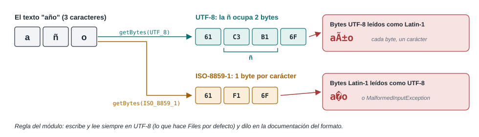
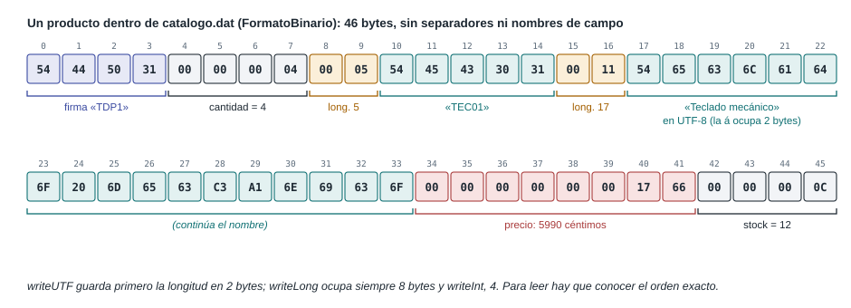
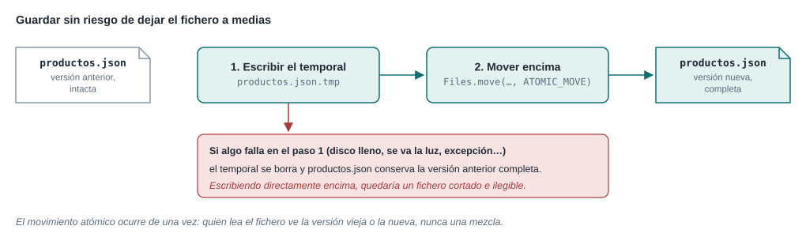

# Unidad Didáctica 1 · Ficheros
{: .no_toc }

*Acceso a Datos · 2.º DAM · Versión del 01/10/2026*

<details open markdown="block">
  <summary>Contenido de la unidad</summary>
  {: .text-delta }
1. TOC
{:toc}
</details>


## Presentación de la unidad

Antes de las bases de datos, los datos de una aplicación viven en ficheros: configuraciones, catálogos exportados, registros de actividad, intercambios con otros programas. En esta unidad, de 12 horas, aprendes a manejar ficheros y directorios, a elegir entre las distintas formas de acceso, a leer y escribir texto, binario, CSV, JSON y XML, y a convertir unos formatos en otros.

Al terminar, tu proyecto integrador dejará de perder los datos al cerrarse: tendrá un **componente de acceso a ficheros** que implementa la interfaz de repositorio del Hito 0, sin que la consola ni el servicio cambien.

### Resultados de aprendizaje y criterios de evaluación

**RA1.** Desarrolla aplicaciones que gestionan información almacenada en ficheros identificando el campo de aplicación de los mismos y utilizando clases específicas.

**RA6.** Programa componentes de acceso a datos identificando las características que debe poseer un componente y utilizando herramientas de desarrollo (solo el criterio c en esta unidad).

| Criterio de evaluación | Apartados |
|---|---|
| 1a) Se han utilizado clases para la gestión de ficheros y directorios | 1.1 |
| 1b) Se han valorado las ventajas y los inconvenientes de las distintas formas de acceso | 1.2, 1.4 |
| 1c) Se han utilizado clases para recuperar información almacenada en ficheros | 1.3, 1.4, 1.5 |
| 1d) Se han utilizado clases para almacenar información en ficheros | 1.3, 1.4, 1.5, 1.9 |
| 1e) Se han utilizado clases para realizar conversiones entre diferentes formatos de ficheros | 1.6 |
| 1f) Se han previsto y gestionado las excepciones | 1.8 (y en todos los apartados) |
| 1g) Se han probado y documentado las aplicaciones desarrolladas | 1.8 |
| 6c) Se han programado componentes que gestionan información almacenada en ficheros | 1.9 |

### Temporalización

| Sesión | Fecha | Horas | Contenidos |
|---|---|---|---|
| 1 | Miércoles 30/09/2026 | 1 | 1.1 Rutas, ficheros y directorios |
| 2 | Jueves 01/10/2026 | 2 | 1.2 Formas de acceso · 1.3 Ficheros de texto y configuración |
| 3 | Martes 06/10/2026 | 1 | 1.4 Ficheros binarios y acceso aleatorio (entrega del Hito 0) |
| 4 | Miércoles 07/10/2026 | 1 | 1.4 Serialización · 1.5 CSV |
| 5 | Jueves 08/10/2026 | 2 | 1.5 JSON con Jackson y XML con DOM |
| 6 | Martes 13/10/2026 | 1 | 1.6 Conversiones entre formatos |
| 7 | Miércoles 14/10/2026 | 1 | 1.7 Colecciones para procesar los datos |
| 8 | Jueves 15/10/2026 | 2 | 1.8 Excepciones, pruebas y documentación · 1.9 El componente de ficheros |
| 9 | Martes 20/10/2026 | 1 | Práctica: Hito 1 |

### Requisitos previos

- La UD0 completa y el Hito 0 entregado: el proyecto de esta unidad parte de él.
- Saber leer un diagrama de clases (Figuras 0.8 y 0.9).

### Convenciones

Las mismas que en la UD0: listados numerados, órdenes para PowerShell y para bash o zsh cuando difieren, recuadros «Desde C++» y ejercicios «Para practicar», con (A) para los autónomos. Los programas de ejemplo que trabajan con ficheros los crean y los borran en el directorio de trabajo; ejecútalos en una carpeta de pruebas.

---

## 1.1 Rutas, ficheros y directorios

### Dos API: `java.io.File` y `java.nio.file`

Java tiene dos formas de trabajar con ficheros y directorios. La clase `java.io.File` es la original, de 1996; la verás en mucho código y en muchos tutoriales. Desde Java 7 existe el paquete `java.nio.file`, más completo y con mejores errores, y es el que usaremos:

| Para… | API antigua | API actual |
|---|---|---|
| Representar una ruta | `new File("datos/productos.json")` | `Path.of("datos", "productos.json")` |
| Consultar y operar | Métodos de `File` (`exists()`, `delete()`…) | Métodos estáticos de `Files` (`Files.exists(ruta)`, `Files.delete(ruta)`…) |
| Saber por qué ha fallado | `delete()` devuelve `false`, sin más | `Files.delete` lanza `NoSuchFileException`, `AccessDeniedException`… |
| Leer y escribir | `FileReader`, `FileWriter`… | `Files.readString`, `Files.newBufferedReader`… (UTF-8 por defecto) |

Si te encuentras un `File`, `archivo.toPath()` lo convierte en `Path`, y `ruta.toFile()` hace lo contrario.

> **Desde C++.** `Path` y `Files` equivalen a `std::filesystem::path` y a las funciones libres de `std::filesystem` (C++17): `exists`, `create_directories`, `copy`, `remove`…

### Rutas

Una ruta **absoluta** empieza en la raíz del sistema (`C:\Users\ana\tienda` o `/home/ana/tienda`). Una ruta **relativa** (`datos/productos.json`) se resuelve a partir del **directorio de trabajo**: la carpeta desde la que se lanzó el programa. Escribe las rutas con `/` o pasando cada parte como argumento a `Path.of`: Java lo traduce a `\` en Windows.

**Listado 1.1.** `Rutas.java`: operaciones con rutas, ficheros y directorios

```java
import java.io.IOException;
import java.nio.file.Files;
import java.nio.file.Path;
import java.util.stream.Stream;

public class Rutas {
    public static void main(String[] args) throws IOException {
        Path datos = Path.of("datos", "productos.json");        // ruta relativa
        System.out.println(datos);                               // datos/productos.json (datos\productos.json en Windows)
        System.out.println(datos.getFileName());                 // productos.json
        System.out.println(datos.getParent());                   // datos
        System.out.println(datos.isAbsolute());                  // false
        System.out.println(datos.toAbsolutePath());              // /home/ana/tienda/datos/productos.json

        Path copia = datos.resolveSibling("copia.json");         // datos/copia.json
        Path rara = Path.of("datos/../datos/./productos.json");
        System.out.println(copia + "  " + rara.normalize());     // datos/copia.json  datos/productos.json
        System.out.println(Path.of("datos").relativize(Path.of("export/catalogo.csv")));  // ../export/catalogo.csv

        Path carpeta = Files.createDirectories(Path.of("prueba", "sub"));   // crea las que falten
        Path fichero = carpeta.resolve("hola.txt");
        Files.writeString(fichero, "Hola, ficheros\n");
        System.out.println(Files.exists(fichero) + " " + Files.isDirectory(carpeta) + " " + Files.size(fichero));  // true true 15
        Files.copy(fichero, carpeta.resolve("copia.txt"));
        Files.move(carpeta.resolve("copia.txt"), Path.of("prueba", "movida.txt"));

        try (Stream<Path> contenido = Files.walk(Path.of("prueba"))) {       // recorre el árbol
            contenido.sorted().forEach(System.out::println);
        }
        try (Stream<Path> contenido = Files.walk(Path.of("prueba"))) {       // borrar: primero lo de dentro
            contenido.sorted(java.util.Comparator.reverseOrder()).forEach(p -> {
                try { Files.delete(p); } catch (IOException e) { throw new java.io.UncheckedIOException(e); }
            });
        }
        System.out.println(Files.exists(Path.of("prueba")));     // false
    }
}
```

| Método de `Path` | Resultado |
|---|---|
| `getFileName()`, `getParent()` | Último elemento de la ruta y la ruta sin él |
| `resolve("x")` | La ruta con `x` añadido: `datos` → `datos/x` |
| `resolveSibling("x")` | Cambia el último elemento: `datos/a.json` → `datos/x` |
| `normalize()` | Quita `.` y `..` |
| `relativize(otra)` | Cómo llegar de una ruta a otra |
| `toAbsolutePath()` | La ruta completa, a partir del directorio de trabajo |

| Método de `Files` | Para qué |
|---|---|
| `exists`, `notExists`, `isDirectory`, `isRegularFile`, `isReadable` | Comprobar |
| `size`, `getLastModifiedTime` | Consultar atributos |
| `createDirectory` / `createDirectories` | Crear una carpeta / crear también las intermedias que falten |
| `copy`, `move` | Copiar y mover; fallan si el destino existe, salvo con `StandardCopyOption.REPLACE_EXISTING` |
| `delete` / `deleteIfExists` | Borrar; un directorio solo si está vacío |
| `list` / `walk` | Contenido de un directorio / de todo el árbol. Devuelven un `Stream` que **hay que cerrar** |

### El directorio de trabajo, fuente de sorpresas

El programa de la tienda guardará sus datos en `datos/productos.json`, una ruta relativa. Dónde acaba ese fichero depende de desde dónde se lance el programa, y aquí hay una trampa: `./gradlew run` ejecuta la aplicación desde la carpeta del **subproyecto** (`app/`), mientras que el botón **Run** de VS Code lo hace desde la carpeta abierta (la raíz).


*Figura 1.1. Una ruta relativa depende del directorio de trabajo.*

Para que los dos coincidan, indica a Gradle el directorio de trabajo en la tarea `run`:

**Listado 1.2.** El bloque `run` de `app/build.gradle.kts`, ampliado

```kotlin
tasks.named<JavaExec>("run") {
    standardInput = System.`in`           // conecta el teclado
    workingDir = rootProject.projectDir   // las rutas relativas parten de la raíz del proyecto
}
```

Cuando dudes, imprime `Path.of("").toAbsolutePath()` o `System.getProperty("user.dir")`: ambos muestran el directorio de trabajo.

### Para practicar

1. Escribe un programa que reciba una carpeta por teclado y muestre su contenido con `Files.list`: primero las carpetas y después los ficheros, cada uno con su tamaño en KB. Si la carpeta no existe, muestra un mensaje claro.
2. Con `Files.walk`, cuenta cuántos ficheros `.java` hay en tu proyecto y cuántas líneas suman (`Files.readAllLines(…).size()`).
3. Ejecuta tu proyecto del Hito 0 con `./gradlew run` y con **Run** de VS Code imprimiendo `Path.of("").toAbsolutePath()` al arrancar. Añade el Listado 1.2 y repite.
4. (A) Escribe un método `copiaDeSeguridad(Path fichero)` que copie el fichero a una carpeta `copias/` con la fecha y hora en el nombre (`productos-2026-10-01T10-30.json`), creando la carpeta si no existe.

---

## 1.2 Formas de acceso a un fichero

Para el disco, un fichero es solo una secuencia de bytes. Cómo se interpretan esos bytes y en qué orden se recorren es una decisión del programa, y cada opción tiene ventajas e inconvenientes.

### Texto o binario

| | Fichero de texto | Fichero binario |
|---|---|---|
| Contenido | Caracteres codificados (UTF-8, por ejemplo) | Valores en su representación interna: un `int` son 4 bytes |
| Se puede leer con un editor | Sí | No: se ve basura |
| Tamaño | Mayor: `219.00` ocupa 6 bytes | Menor: un `long` ocupa siempre 8 |
| Portabilidad | Cualquier programa, en cualquier lenguaje | Solo el que conoce la estructura exacta |
| Ejemplos | `.txt`, `.csv`, `.json`, `.xml`, `.properties` | `.png`, `.pdf`, `.zip`, el `.dat` de la tienda |

### Flujos de bytes y flujos de caracteres

Java lee y escribe mediante **flujos** (*streams*, que no hay que confundir con los *streams* de colecciones del apartado 0.7). Hay dos familias: los **flujos de bytes** (`InputStream` y `OutputStream`) y los **flujos de caracteres** (`Reader` y `Writer`). Un flujo puede envolver a otro para añadirle capacidades: el que convierte bytes en caracteres, el que lee por bloques…


*Figura 1.2. Los flujos se envuelven unos a otros.*

| Familia | Leer | Escribir | Para |
|---|---|---|---|
| Bytes | `InputStream`, `BufferedInputStream`, `DataInputStream`, `ObjectInputStream` | `OutputStream`, `BufferedOutputStream`, `DataOutputStream`, `ObjectOutputStream` | Ficheros binarios (1.4) |
| Caracteres | `Reader`, `BufferedReader`, `InputStreamReader` | `Writer`, `BufferedWriter`, `OutputStreamWriter` | Ficheros de texto (1.3 y 1.5) |
| Acceso directo | `RandomAccessFile` (lee y escribe en cualquier posición) | | Registros de longitud fija (1.4) |

Todos son recursos que hay que cerrar: se abren siempre en un `try-with-resources` (apartado 0.8). Y casi siempre conviene un `Buffered…`, que lee o escribe por bloques en lugar de byte a byte.

### Codificaciones de caracteres

Un fichero de texto guarda bytes, no letras. La **codificación** es la tabla que traduce entre unos y otras. En ASCII coinciden casi todas; con la ñ, los acentos o el símbolo del euro, no.



*Figura 1.3. El mismo texto en dos codificaciones.*

**Listado 1.3.** `Codificaciones.java`

```java
import java.io.IOException;
import java.nio.charset.StandardCharsets;
import java.nio.file.Files;
import java.nio.file.Path;
import java.util.HexFormat;

public class Codificaciones {
    public static void main(String[] args) throws IOException {
        String texto = "año";
        byte[] utf8 = texto.getBytes(StandardCharsets.UTF_8);
        byte[] latin1 = texto.getBytes(StandardCharsets.ISO_8859_1);
        System.out.println(HexFormat.ofDelimiter(" ").formatHex(utf8));     // 61 c3 b1 6f
        System.out.println(HexFormat.ofDelimiter(" ").formatHex(latin1));   // 61 f1 6f

        // Leer con la codificación equivocada
        System.out.println(new String(utf8, StandardCharsets.ISO_8859_1));  // año
        System.out.println(new String(latin1, StandardCharsets.UTF_8));     // a�o

        Path fichero = Path.of("latin1.txt");
        Files.writeString(fichero, texto, StandardCharsets.ISO_8859_1);
        try {
            Files.readString(fichero);                                      // supone UTF-8
        } catch (IOException e) {
            System.out.println(e);                                          // MalformedInputException
        }
        System.out.println(Files.readString(fichero, StandardCharsets.ISO_8859_1));   // año
        Files.delete(fichero);
    }
}
```

Desde Java 18 (JEP 400), la codificación por defecto es UTF-8 en todos los sistemas, y los métodos de `Files` la usan siempre. Aun así, los ficheros que te lleguen de otros programas pueden venir en otra (Excel en Windows, por ejemplo, suele guardar los CSV en Windows-1252), así que **la codificación forma parte del formato** y hay que documentarla.

### Acceso secuencial y acceso aleatorio

En el **acceso secuencial** el fichero se recorre de principio a fin, como una cinta. Es lo natural en los ficheros de texto: cada línea mide distinto y no hay forma de saber dónde empieza la décima sin leer las nueve anteriores. En el **acceso aleatorio** (o directo) el programa salta a cualquier posición. Para saber a cuál, los datos se guardan en **registros de longitud fija**: si cada uno ocupa 84 bytes, el registro *n* empieza en el byte *n* × 84.


*Figura 1.4. Acceso secuencial y acceso aleatorio con registros de longitud fija.*

| | Acceso secuencial | Acceso aleatorio |
|---|---|---|
| Encontrar un registro | Hay que leer desde el principio | Inmediato, si conoces su posición |
| Modificar un dato | Hay que reescribir el fichero entero | Se sobrescriben solo sus bytes |
| Longitud de los datos | Libre | Fija: los textos largos se recortan y los cortos desperdician espacio |
| Insertar o borrar | Reescribir el fichero | Complicado: huecos, marcas de borrado… |
| Formato | Texto o binario | Binario |
| Cuándo usarlo | Casi siempre: configuración, intercambio, exportaciones, ficheros pequeños | Muchos registros que se consultan y actualizan de uno en uno |

En la práctica, cuando necesitas acceso directo a muchos registros, usas una base de datos, que es exactamente eso pero con índices, transacciones y consultas: lo verás en la UD2. Aun así, conviene haberlo programado una vez para entender qué hace por ti.

### Para practicar

1. Guarda la palabra «pingüino» en un fichero con UTF-8 y con ISO-8859-1. Compara los tamaños con `Files.size` y explica la diferencia.
2. Abre en un editor el fichero ISO-8859-1 del ejercicio anterior. ¿Qué codificación supone el editor? ¿Cómo se lo cambias?
3. Para cada caso, decide si usarías un fichero de texto o binario, y acceso secuencial o aleatorio, y justifícalo: la configuración de una aplicación, un registro de errores, las fichas de 50 000 socios que se consultan por número, la exportación de un catálogo para otra empresa.

---

## 1.3 Ficheros de texto y configuración

### Leer y escribir texto

`Files` ofrece métodos para casi todo, y todos usan UTF-8 si no indicas otra codificación:

| Método | Qué hace | Cuándo |
|---|---|---|
| `Files.readString(ruta)` | Todo el fichero en un `String` | Ficheros pequeños |
| `Files.readAllLines(ruta)` | Todas las líneas en una `List<String>` | Ficheros pequeños |
| `Files.lines(ruta)` | Un *stream* que lee línea a línea | Ficheros grandes; hay que cerrarlo |
| `Files.newBufferedReader(ruta)` | Un `BufferedReader` para leer con `readLine()` | Cuando necesitas control línea a línea |
| `Files.writeString(ruta, texto, opciones…)` | Escribe un `String` | Ficheros pequeños |
| `Files.write(ruta, lineas, opciones…)` | Escribe una colección de líneas | Ficheros pequeños |
| `Files.newBufferedWriter(ruta, opciones…)` | Un `BufferedWriter` para escribir por partes | Ficheros grandes |

Sin opciones, escribir **crea el fichero o lo vacía** si ya existía. Las opciones de `StandardOpenOption` cambian ese comportamiento:

| Opción | Efecto |
|---|---|
| `CREATE` + `APPEND` | Añade al final; crea el fichero si no existe |
| `CREATE_NEW` | Falla con `FileAlreadyExistsException` si ya existe: nunca machaca |
| `TRUNCATE_EXISTING` | Vacía el fichero antes de escribir (es lo que se hace por defecto) |

**Listado 1.4.** `Movimientos.java`: un registro de movimientos de stock

```java
import java.io.IOException;
import java.nio.file.Files;
import java.nio.file.Path;
import java.nio.file.StandardOpenOption;
import java.time.LocalDateTime;
import java.time.format.DateTimeFormatter;
import java.util.List;
import java.util.stream.Stream;

public class Movimientos {

    private static final Path REGISTRO = Path.of("movimientos.log");
    private static final DateTimeFormatter FORMATO = DateTimeFormatter.ofPattern("yyyy-MM-dd HH:mm:ss");

    static void anotar(String codigo, int unidades) throws IOException {
        String linea = LocalDateTime.now().format(FORMATO) + ";" + codigo + ";" + unidades + System.lineSeparator();
        Files.writeString(REGISTRO, linea, StandardOpenOption.CREATE, StandardOpenOption.APPEND);
    }

    public static void main(String[] args) throws IOException {
        anotar("TEC01", -2);
        anotar("RAT01", 10);
        anotar("TEC01", -1);

        List<String> todas = Files.readAllLines(REGISTRO);             // todo a memoria: ficheros pequeños
        System.out.println(todas.size() + " líneas");

        try (Stream<String> lineas = Files.lines(REGISTRO)) {          // línea a línea: ficheros grandes
            int vendidasTec = lineas.map(l -> l.split(";"))
                    .filter(campos -> campos[1].equals("TEC01"))
                    .mapToInt(campos -> Integer.parseInt(campos[2]))
                    .sum();
            System.out.println("Movimiento neto de TEC01: " + vendidasTec);   // -3
        }
        Files.delete(REGISTRO);
    }
}
```

`System.lineSeparator()` es el salto de línea del sistema (`\r\n` en Windows, `\n` en macOS y Linux). Al leer, `readLine`, `readAllLines` y `lines` reconocen los dos.

### Ficheros de configuración: `Properties`

Muchas aplicaciones guardan su configuración en un fichero `.properties`: líneas `clave=valor` y comentarios que empiezan por `#`. La clase `Properties` los lee y los escribe. En la UD2 lo usarás para sacar del código la dirección y las credenciales de la base de datos.

**Listado 1.5.** `Propiedades.java`

```java
import java.io.IOException;
import java.io.Reader;
import java.io.Writer;
import java.nio.file.Files;
import java.nio.file.Path;
import java.util.Properties;

public class Propiedades {
    public static void main(String[] args) throws IOException {
        Path fichero = Path.of("config.properties");
        Files.writeString(fichero, """
                # Configuración de la tienda
                datos.ruta=datos/productos.json
                tienda.nombre=Informática Alhambra
                """);

        Properties config = new Properties();
        try (Reader lector = Files.newBufferedReader(fichero)) {       // UTF-8: respeta la «á»
            config.load(lector);
        }
        System.out.println(config.getProperty("datos.ruta"));           // datos/productos.json
        System.out.println(config.getProperty("tienda.nombre"));        // Informática Alhambra
        System.out.println(config.getProperty("idioma", "es"));         // es (valor por defecto)

        config.setProperty("ultima.exportacion", "export/catalogo.csv");
        try (Writer escritor = Files.newBufferedWriter(fichero)) {
            config.store(escritor, "Configuración de la tienda");       // reescribe el fichero completo
        }
        System.out.print(Files.readString(fichero));
        Files.delete(fichero);
    }
}
```

```text
datos/productos.json
Informática Alhambra
es
#Configuración de la tienda
#Thu Oct 01 13:45:48 UTC 2026
datos.ruta=datos/productos.json
tienda.nombre=Informática Alhambra
ultima.exportacion=export/catalogo.csv
```

Dos detalles importantes. Carga el fichero con un `Reader` (`Files.newBufferedReader`): la versión de `load` que recibe un `InputStream` supone la codificación ISO-8859-1 y estropearía la «á». Y `store` reescribe el fichero completo, con sus propios comentarios: los tuyos se pierden. Por eso la configuración se suele editar a mano y el programa solo la lee.

En el proyecto, una clase pequeña se encarga de leer la configuración y ofrece métodos con nombre, para que el resto del código no maneje claves de texto:

**Listado 1.6.** `config/Configuracion.java`

```java
package es.dam.tienda.config;

import java.io.IOException;
import java.io.Reader;
import java.io.UncheckedIOException;
import java.nio.file.Files;
import java.nio.file.Path;
import java.util.Properties;

/** Configuración de la aplicación, leída de un fichero .properties. */
public class Configuracion {

    private final Properties propiedades = new Properties();

    /**
     * Carga el fichero si existe; si no existe, se usan los valores por defecto.
     *
     * @throws UncheckedIOException si el fichero existe pero no se puede leer
     */
    public Configuracion(Path fichero) {
        if (Files.exists(fichero)) {
            try (Reader lector = Files.newBufferedReader(fichero)) {   // UTF-8
                propiedades.load(lector);
            } catch (IOException e) {
                throw new UncheckedIOException("No se pudo leer " + fichero, e);
            }
        }
    }

    /** @return ruta del fichero de datos; su extensión decide el formato */
    public Path rutaDatos() {
        return Path.of(propiedades.getProperty("datos.ruta", "datos/productos.json"));
    }
}
```

**Listado 1.7.** `config.properties`, en la raíz del proyecto

```properties
# Configuración de la tienda
# La extensión del fichero de datos decide el formato: json, csv, xml o dat
datos.ruta=datos/productos.json
```

### Para practicar

1. Amplía `Movimientos` para que muestre, para cada código, la suma de sus movimientos. Pista: `Collectors.groupingBy` (apartado 1.7) o un `Map` que vayas rellenando.
2. Escribe un programa que lea un fichero de texto y genere otro con las líneas numeradas (`  1 | …`), sin cargarlo entero en memoria.
3. Añade a `Configuracion` un método `String nombreTienda()` con un valor por defecto, y comprueba qué pasa si borras `config.properties`.
4. (A) Escribe un `.properties` con la línea `tienda.nombre=Informática Alhambra`, cárgalo con `load(InputStream)` y con `load(Reader)`, y compara los resultados.

---

## 1.4 Ficheros binarios

### Una interfaz para todos los formatos

A partir de aquí guardarás el catálogo de la tienda en varios formatos. Para no repetir código ni acoplar el modelo a ninguno, se usan dos piezas que aparecerán en el resto de la unidad.

La primera es un *record* con los datos tal como se guardan. Se llama **DTO** (*Data Transfer Object*): un objeto que solo transporta datos de un sitio a otro. Así la clase `Producto` no tiene que saber nada de ficheros, y si mañana añades un atributo calculado al modelo, los ficheros no cambian.

**Listado 1.8.** `fichero/ProductoDto.java`

```java
package es.dam.tienda.fichero;

import es.dam.tienda.modelo.Producto;
import java.io.Serializable;
import java.math.BigDecimal;

/**
 * Un producto tal como se guarda en un fichero: datos planos, sin comportamiento.
 * Separa el formato de los ficheros de la clase del modelo.
 */
public record ProductoDto(String codigo, String nombre, BigDecimal precio, int stock)
        implements Serializable {

    /** Copia los datos de un producto del modelo. */
    public static ProductoDto desde(Producto producto) {
        return new ProductoDto(producto.getCodigo(), producto.getNombre(),
                producto.getPrecio(), producto.getStock());
    }

    /** Crea un producto del modelo; su constructor valida los datos leídos. */
    public Producto aProducto() {
        return new Producto(codigo, nombre, precio, stock);
    }
}
```

La segunda es una interfaz con las dos operaciones que debe ofrecer cualquier formato. Es la misma idea que `ProductoRepository`: el código que la use no sabrá qué formato tiene delante.

**Listado 1.9.** `fichero/FormatoProductos.java`

```java
package es.dam.tienda.fichero;

import java.io.IOException;
import java.nio.file.Path;
import java.util.List;

/** Un formato de fichero capaz de leer y escribir una lista de productos. */
public interface FormatoProductos {

    /**
     * Lee todos los productos de un fichero.
     *
     * @param ruta fichero que se va a leer
     * @return los productos, en el orden en que aparecen en el fichero
     * @throws IOException si el fichero no se puede leer o su contenido no es válido
     */
    List<ProductoDto> leer(Path ruta) throws IOException;

    /**
     * Escribe los productos en un fichero, reemplazando su contenido.
     *
     * @param ruta fichero que se va a escribir
     * @param productos productos que se guardan
     * @throws IOException si el fichero no se puede escribir
     */
    void escribir(Path ruta, List<ProductoDto> productos) throws IOException;
}
```

Fíjate en que los métodos declaran `throws IOException`: leer y escribir ficheros puede fallar por causas ajenas al programa, y quien los llame debe decidir qué hacer.

### Datos primitivos con `DataOutputStream` y `DataInputStream`

`DataOutputStream` escribe valores de Java en binario, y `DataInputStream` los lee **en el mismo orden**. El fichero no contiene nombres de campos ni separadores: la estructura solo existe en el código.

| Escribir | Leer | Bytes |
|---|---|---|
| `writeInt` | `readInt` | 4 |
| `writeLong` | `readLong` | 8 |
| `writeDouble` | `readDouble` | 8 |
| `writeBoolean` | `readBoolean` | 1 |
| `writeUTF` | `readUTF` | 2 de longitud + el texto (hasta 65 535 bytes) |

**Listado 1.10.** `fichero/FormatoBinario.java`

```java
package es.dam.tienda.fichero;

import java.io.BufferedInputStream;
import java.io.BufferedOutputStream;
import java.io.DataInputStream;
import java.io.DataOutputStream;
import java.io.IOException;
import java.math.BigDecimal;
import java.nio.file.Files;
import java.nio.file.Path;
import java.util.ArrayList;
import java.util.List;

/**
 * Fichero binario propio: una firma que identifica el formato, el número de
 * productos y, después, los campos de cada producto en un orden fijo.
 * El precio se guarda en céntimos.
 */
public class FormatoBinario implements FormatoProductos {

    private static final int FIRMA = 0x54445031;    // los bytes de "TDP1": Tienda, Datos de Productos, versión 1

    @Override
    public List<ProductoDto> leer(Path ruta) throws IOException {
        try (DataInputStream entrada = new DataInputStream(
                new BufferedInputStream(Files.newInputStream(ruta)))) {
            if (entrada.readInt() != FIRMA) {
                throw new IOException(ruta + " no es un fichero binario de productos");
            }
            int cantidad = entrada.readInt();
            List<ProductoDto> productos = new ArrayList<>();
            for (int i = 0; i < cantidad; i++) {
                String codigo = entrada.readUTF();
                String nombre = entrada.readUTF();
                BigDecimal precio = BigDecimal.valueOf(entrada.readLong(), 2);   // céntimos → euros
                int stock = entrada.readInt();
                productos.add(new ProductoDto(codigo, nombre, precio, stock));
            }
            return productos;
        }
    }

    @Override
    public void escribir(Path ruta, List<ProductoDto> productos) throws IOException {
        try (DataOutputStream salida = new DataOutputStream(
                new BufferedOutputStream(Files.newOutputStream(ruta)))) {
            salida.writeInt(FIRMA);
            salida.writeInt(productos.size());
            for (ProductoDto p : productos) {
                salida.writeUTF(p.codigo());
                salida.writeUTF(p.nombre());
                salida.writeLong(p.precio().movePointRight(2).longValueExact());   // euros → céntimos
                salida.writeInt(p.stock());
            }
        }
    }
}
```



*Figura 1.5. Cómo queda un producto dentro del fichero binario.*

Dos decisiones del formato merecen explicación:

- **El precio se guarda en céntimos**, como un `long`: es exacto y ocupa siempre 8 bytes. A cambio, un precio con más de dos decimales hace fallar `longValueExact` con `ArithmeticException`.
- **El fichero empieza con una firma.** Sin ella, al leer por error un CSV como binario, los cuatro primeros caracteres (`codi`) se interpretan como la cantidad de productos: 1 668 244 585. El programa intentaría leer mil seiscientos millones de productos. Con la firma, el error se detecta en el primer `readInt`. Los formatos binarios reales hacen lo mismo: todo PDF empieza por `%PDF` y todo ZIP por `PK`.

### Acceso aleatorio con `RandomAccessFile`

`RandomAccessFile` lee y escribe en cualquier posición del fichero. Mantiene un **puntero**: `seek(posicion)` lo mueve, `getFilePointer()` lo consulta y cada lectura o escritura lo avanza. Se abre en modo `"r"` (solo lectura) o `"rw"` (lectura y escritura). El siguiente ejemplo implementa los registros de 84 bytes de la Figura 1.4.

**Listado 1.11.** `CatalogoAleatorio.java`

```java
import java.io.IOException;
import java.io.RandomAccessFile;
import java.math.BigDecimal;

/**
 * Productos en registros de longitud fija: código (6 caracteres), nombre (30 caracteres),
 * precio en céntimos (long) y stock (int). Cada registro ocupa 84 bytes.
 */
public class CatalogoAleatorio implements AutoCloseable {

    static final int LONG_CODIGO = 6;                               // caracteres
    static final int LONG_NOMBRE = 30;                              // caracteres
    static final int TAM_REGISTRO = (LONG_CODIGO + LONG_NOMBRE) * 2 + Long.BYTES + Integer.BYTES;   // 84 bytes
    static final int DESPL_STOCK = (LONG_CODIGO + LONG_NOMBRE) * 2 + Long.BYTES;                   // 80

    private final RandomAccessFile fichero;

    public CatalogoAleatorio(String ruta) throws IOException {
        fichero = new RandomAccessFile(ruta, "rw");                 // lectura y escritura
    }

    public long numeroRegistros() throws IOException {
        return fichero.length() / TAM_REGISTRO;
    }

    /** Añade un registro al final del fichero. */
    public void agregar(String codigo, String nombre, BigDecimal precio, int stock) throws IOException {
        fichero.seek(fichero.length());
        escribirTexto(codigo, LONG_CODIGO);
        escribirTexto(nombre, LONG_NOMBRE);
        fichero.writeLong(precio.movePointRight(2).longValueExact());
        fichero.writeInt(stock);
    }

    /** Lee el registro número n (empezando en 0) sin leer los anteriores. */
    public String leer(long n) throws IOException {
        fichero.seek(n * TAM_REGISTRO);
        String codigo = leerTexto(LONG_CODIGO);
        String nombre = leerTexto(LONG_NOMBRE);
        BigDecimal precio = BigDecimal.valueOf(fichero.readLong(), 2);
        int stock = fichero.readInt();
        return codigo + " | " + nombre + " | " + precio + " | " + stock;
    }

    /** Cambia solo el stock del registro n: escribe 4 bytes en mitad del fichero. */
    public void cambiarStock(long n, int stock) throws IOException {
        fichero.seek(n * TAM_REGISTRO + DESPL_STOCK);
        fichero.writeInt(stock);
    }

    private void escribirTexto(String texto, int longitud) throws IOException {
        StringBuilder relleno = new StringBuilder(texto);
        relleno.setLength(longitud);                                // recorta o rellena con '\0'
        fichero.writeChars(relleno.toString());                     // 2 bytes por carácter
    }

    private String leerTexto(int longitud) throws IOException {
        char[] letras = new char[longitud];
        for (int i = 0; i < longitud; i++) {
            letras[i] = fichero.readChar();
        }
        return new String(letras).replace("\0", "").strip();
    }

    @Override
    public void close() throws IOException {
        fichero.close();
    }

    public static void main(String[] args) throws IOException {
        try (CatalogoAleatorio catalogo = new CatalogoAleatorio("catalogo.bin")) {
            catalogo.agregar("TEC01", "Teclado mecánico", new BigDecimal("59.90"), 12);
            catalogo.agregar("RAT01", "Ratón inalámbrico", new BigDecimal("24.50"), 30);
            catalogo.agregar("MON01", "Monitor 27 pulgadas", new BigDecimal("219.00"), 4);

            System.out.println(catalogo.numeroRegistros() + " registros");   // 3 registros
            System.out.println(catalogo.leer(2));                  // MON01 | Monitor 27 pulgadas | 219.00 | 4
            catalogo.cambiarStock(0, 9);
            System.out.println(catalogo.leer(0));                  // TEC01 | Teclado mecánico | 59.90 | 9
        }
        System.out.println(new java.io.File("catalogo.bin").length() + " bytes");   // 252 bytes
        new java.io.File("catalogo.bin").delete();
    }
}
```

`writeChars` guarda cada carácter en 2 bytes (UTF-16), así que un texto de longitud fija ocupa siempre lo mismo, lleve tildes o no. El precio de esa sencillez es el espacio: los 30 caracteres del nombre ocupan 60 bytes aunque el nombre sea «Ratón».

### Serialización de objetos

La **serialización** convierte un objeto, y todos los objetos a los que apunta, en una secuencia de bytes; la deserialización hace el camino inverso. Basta con que las clases implementen la interfaz `Serializable`, que no tiene métodos: es una marca.

**Listado 1.12.** `Serializacion.java`

```java
import java.io.*;
import java.math.BigDecimal;
import java.nio.file.Files;
import java.nio.file.Path;
import java.util.ArrayList;
import java.util.List;

public class Serializacion {

    record ProductoDto(String codigo, String nombre, BigDecimal precio, int stock) implements Serializable {}

    public static void main(String[] args) throws IOException, ClassNotFoundException {
        Path fichero = Path.of("productos.ser");
        List<ProductoDto> productos = new ArrayList<>(List.of(
                new ProductoDto("TEC01", "Teclado mecánico", new BigDecimal("59.90"), 12),
                new ProductoDto("RAT01", "Ratón inalámbrico", new BigDecimal("24.50"), 30)));

        try (ObjectOutputStream salida = new ObjectOutputStream(Files.newOutputStream(fichero))) {
            salida.writeObject(productos);                  // la lista y todo lo que contiene
        }

        try (ObjectInputStream entrada = new ObjectInputStream(Files.newInputStream(fichero))) {
            @SuppressWarnings("unchecked")
            List<ProductoDto> leidos = (List<ProductoDto>) entrada.readObject();
            System.out.println(leidos.equals(productos) + ", " + Files.size(fichero) + " bytes");
        }
        Files.delete(fichero);
    }
}
```

```text
true, 596 bytes
```


*Figura 1.6. Serializar y deserializar un grafo de objetos.*

Es cómoda, pero tiene inconvenientes serios: el fichero solo lo entiende un programa Java con esas mismas clases, cambiar una clase puede inutilizar los ficheros antiguos y, sobre todo, **deserializar datos de origen desconocido es una vulnerabilidad conocida**, porque el proceso puede crear objetos de clases que ejecuten código. Las guías de seguridad de Oracle y de OWASP recomiendan no usarla para datos que vengan de fuera.

Si la usas con clases normales, declara un `private static final long serialVersionUID = 1L;` para controlar la versión, y marca como `transient` los atributos que no deben guardarse. Con los *records* es más segura, porque se reconstruyen llamando a su constructor, con sus validaciones. En este módulo la verás aquí y no la usarás para guardar datos: para eso están los formatos del apartado siguiente.

### Para practicar

1. Exporta el catálogo de la tienda a `.dat` y ábrelo con un editor hexadecimal o con `Format-Hex` en PowerShell (`od -A d -t x1z` en macOS y Linux). Localiza la firma y el precio de un producto.
2. Cambia `FormatoBinario` para guardar el precio como `double`. ¿Cuántos bytes ocupa ahora cada producto? ¿Qué se pierde?
3. Añade a `CatalogoAleatorio` un método `buscar(String codigo)` que recorra los registros y devuelva su posición o `-1`. ¿Cuántas lecturas hace en el peor caso?
4. (A) Añade a `CatalogoAleatorio` un borrado lógico: un `boolean` al principio de cada registro que indique si está activo. Recalcula `TAM_REGISTRO` y los desplazamientos.

---

## 1.5 Formatos de intercambio: CSV, JSON y XML

Para que otros programas (una hoja de cálculo, una web, la aplicación de un proveedor) lean tus datos, hay que usar un formato estándar de texto. Los tres más extendidos guardan lo mismo con estructuras distintas:


*Figura 1.7. Los mismos productos en CSV, JSON y XML.*

| | CSV | JSON | XML |
|---|---|---|---|
| Estructura | Tabla plana | Objetos, listas y valores anidados | Árbol de elementos y atributos |
| Tipos | Todo es texto | Texto, número, booleano, `null`, objeto, lista | Todo es texto (salvo que un esquema diga otra cosa) |
| Tamaño | El más compacto | Intermedio | El más extenso |
| Validación formal | No | JSON Schema | DTD o XML Schema |
| Uso típico | Hojas de cálculo, datos abiertos, exportaciones | API web, configuración, bases de datos documentales (UD5) | Documentos, administración pública, configuración Java tradicional |
| En Java | A mano, o con una biblioteca | Jackson (biblioteca externa) | DOM, SAX o StAX (incluidos en el JDK) |

### CSV

Un CSV (*comma-separated values*) es un texto con una línea por registro y los campos separados por un carácter. Aunque el nombre dice «coma», en España es habitual el punto y coma, porque la coma es el separador decimal: es lo que espera Excel con la configuración española. El formato tiene una especificación (RFC 4180) que muchos programas no siguen del todo, y sus problemas aparecen enseguida: ¿qué pasa si un nombre contiene el separador? La regla es encerrar ese campo entre comillas, y escribir dos comillas para representar una.

**Listado 1.13.** `fichero/FormatoCsv.java`

```java
package es.dam.tienda.fichero;

import java.io.BufferedReader;
import java.io.BufferedWriter;
import java.io.IOException;
import java.math.BigDecimal;
import java.nio.file.Files;
import java.nio.file.Path;
import java.util.ArrayList;
import java.util.List;

/** Texto separado por punto y coma, con una línea de cabecera. Codificación UTF-8. */
public class FormatoCsv implements FormatoProductos {

    private static final char SEPARADOR = ';';
    private static final String CABECERA = "codigo;nombre;precio;stock";

    @Override
    public List<ProductoDto> leer(Path ruta) throws IOException {
        List<ProductoDto> productos = new ArrayList<>();
        try (BufferedReader lector = Files.newBufferedReader(ruta)) {
            String linea = lector.readLine();                 // la cabecera no son datos
            int numero = 1;
            while ((linea = lector.readLine()) != null) {
                numero++;
                if (linea.isBlank()) {
                    continue;
                }
                List<String> campos = dividir(linea);
                if (campos.size() != 4) {
                    throw new IOException("Línea " + numero + ": se esperaban 4 campos y hay " + campos.size());
                }
                try {
                    productos.add(new ProductoDto(campos.get(0), campos.get(1),
                            new BigDecimal(campos.get(2)), Integer.parseInt(campos.get(3))));
                } catch (NumberFormatException e) {
                    throw new IOException("Línea " + numero + ": número no válido", e);
                }
            }
        }
        return productos;
    }

    @Override
    public void escribir(Path ruta, List<ProductoDto> productos) throws IOException {
        try (BufferedWriter escritor = Files.newBufferedWriter(ruta)) {
            escritor.write(CABECERA);
            escritor.newLine();
            for (ProductoDto p : productos) {
                escritor.write(String.join(String.valueOf(SEPARADOR),
                        escapar(p.codigo()), escapar(p.nombre()),
                        p.precio().toPlainString(), String.valueOf(p.stock())));
                escritor.newLine();
            }
        }
    }

    /** Entrecomilla un campo si contiene el separador o comillas ("" representa una comilla). */
    static String escapar(String campo) {
        if (campo.indexOf(SEPARADOR) >= 0 || campo.indexOf('"') >= 0) {
            return '"' + campo.replace("\"", "\"\"") + '"';
        }
        return campo;
    }

    /** Divide una línea en campos respetando las comillas: "Cable; 2 m" es un solo campo. */
    static List<String> dividir(String linea) {
        List<String> campos = new ArrayList<>();
        StringBuilder actual = new StringBuilder();
        boolean entreComillas = false;
        for (int i = 0; i < linea.length(); i++) {
            char c = linea.charAt(i);
            if (entreComillas) {
                if (c == '"' && i + 1 < linea.length() && linea.charAt(i + 1) == '"') {
                    actual.append('"');                       // "" dentro de comillas
                    i++;
                } else if (c == '"') {
                    entreComillas = false;
                } else {
                    actual.append(c);
                }
            } else if (c == '"') {
                entreComillas = true;
            } else if (c == SEPARADOR) {
                campos.add(actual.toString());
                actual.setLength(0);
            } else {
                actual.append(c);
            }
        }
        campos.add(actual.toString());
        return campos;
    }
}
```

```text
codigo;nombre;precio;stock
TEC01;Teclado mecánico;59.90;12
HUB01;"Hub USB; 4 puertos ""Pro""";19.99;7
```

Decisiones que conviene documentar junto al formato: separador `;`, codificación UTF-8, primera línea de cabecera y **punto decimal** en los precios (`toPlainString()` no depende de la configuración regional). Un Excel configurado en español leerá `59.90` como texto; si el CSV va destinado a Excel, cambia a coma decimal y documéntalo. Este lector no admite saltos de línea dentro de un campo; si los necesitas, usa una biblioteca como Apache Commons CSV o el módulo CSV de Jackson.

### JSON con Jackson

JSON (*JavaScript Object Notation*) representa objetos como pares `"nombre": valor` entre llaves y listas entre corchetes. Es el formato de las API web, el de la UD6, y la base de MongoDB en la UD5. La biblioteca estándar de Java no incluye un lector de JSON; usaremos **Jackson**, la más extendida, en su versión 3, que es la que utiliza Spring Boot 4.

Jackson es la primera dependencia externa del proyecto. Se añade como viste en el apartado 0.3:

**Listado 1.14.** Jackson en `gradle/libs.versions.toml` y en `app/build.gradle.kts`

```toml
[versions]
junit-jupiter = "6.1.1"
jackson = "3.2.1"

[libraries]
junit-jupiter = { module = "org.junit.jupiter:junit-jupiter", version.ref = "junit-jupiter" }
jackson-databind = { module = "tools.jackson.core:jackson-databind", version.ref = "jackson" }
```

```kotlin
dependencies {
    implementation(libs.jackson.databind)                           // JSON (UD1)
    testImplementation(libs.junit.jupiter)
    testRuntimeOnly("org.junit.platform:junit-platform-launcher")
}
```

`jackson-databind` trae consigo, como dependencias transitivas, `jackson-core` y `jackson-annotations`. Tras guardar, VS Code reimporta el proyecto; si no reconoce las clases de Jackson, ejecuta `./gradlew build` una vez.

El objeto central es un `JsonMapper`, que convierte objetos Java en JSON y al revés. En Jackson 3 se crea con un constructor (*builder*) y después ya no se puede modificar, así que se crea una vez y se reutiliza:

**Listado 1.15.** `fichero/FormatoJson.java`

```java
package es.dam.tienda.fichero;

import java.io.IOException;
import java.nio.file.Files;
import java.nio.file.Path;
import java.util.List;
import tools.jackson.core.JacksonException;
import tools.jackson.databind.SerializationFeature;
import tools.jackson.databind.json.JsonMapper;

/** Un array JSON de objetos, legible y con sangría. Usa Jackson 3. */
public class FormatoJson implements FormatoProductos {

    private final JsonMapper mapper = JsonMapper.builder()
            .enable(SerializationFeature.INDENT_OUTPUT)       // con sangría, para leerlo a simple vista
            .build();

    @Override
    public List<ProductoDto> leer(Path ruta) throws IOException {
        String json = Files.readString(ruta);
        if (json.isBlank()) {
            return List.of();
        }
        try {
            return List.of(mapper.readValue(json, ProductoDto[].class));
        } catch (JacksonException e) {
            throw new IOException("JSON no válido en " + ruta + ": " + e.getMessage(), e);
        }
    }

    @Override
    public void escribir(Path ruta, List<ProductoDto> productos) throws IOException {
        Files.writeString(ruta, mapper.writeValueAsString(productos));
    }
}
```

Jackson recorre el objeto y genera un par `"nombre": valor` por cada componente del *record* (o por cada *getter* de una clase normal); al leer, llama al constructor del *record* con los valores encontrados. Por eso `ProductoDto` es un *record*: funciona sin configurar nada. Para leer una lista se pide un array, `ProductoDto[].class`, y se convierte con `List.of`.

Si has visto ejemplos de Jackson 2, ten en cuenta estas diferencias de la versión 3:

| | Jackson 2 | Jackson 3 |
|---|---|---|
| Paquetes y grupo Maven | `com.fasterxml.jackson…` | `tools.jackson…` (las anotaciones siguen en `com.fasterxml.jackson.annotation`) |
| Configuración del *mapper* | Modificable en cualquier momento | Con `JsonMapper.builder()`; después es inmutable |
| Excepciones | `JsonProcessingException`, comprobada | `JacksonException`, no comprobada |
| Orden de las propiedades | El de declaración | Alfabético por defecto |
| Propiedades desconocidas al leer | Error | Se ignoran por defecto |
| Fechas de `java.time` | Módulo aparte; se escribían como números | Incluidas; se escriben como texto ISO (`"2026-09-16"`) |

Cuando el nombre de un campo en el JSON no coincide con el de Java, o un atributo no debe guardarse, se usan anotaciones como `@JsonProperty("nombre_en_json")` y `@JsonIgnore`. No las necesitamos porque el DTO se ha diseñado para el fichero.

### XML con DOM

XML organiza los datos en **elementos** con etiqueta de apertura y cierre (`<precio>59.90</precio>`), que pueden contener otros elementos y llevar **atributos** (`codigo="TEC01"`). Un documento XML **bien formado** tiene un único elemento raíz, todas las etiquetas cerradas y anidadas correctamente, y los caracteres especiales escapados (`&lt;` para `<`, `&amp;` para `&`).

El JDK incluye tres formas de procesarlo:

| API | Cómo trabaja | Ventajas | Inconvenientes |
|---|---|---|---|
| DOM | Carga el documento entero como un árbol en memoria | Se recorre y modifica libremente | Consume memoria con documentos grandes |
| SAX | Avisa de cada etiqueta según la lee (eventos) | Muy poca memoria | Hay que llevar el estado a mano; solo lectura |
| StAX | Tu código pide el siguiente elemento cuando quiere | Poca memoria y más cómodo que SAX | Solo hacia delante |

Usaremos **DOM**, la más sencilla para documentos de tamaño razonable. El documento se convierte en un árbol de nodos:


*Figura 1.8. Árbol DOM del catálogo.*

**Listado 1.16.** `fichero/FormatoXml.java`

```java
package es.dam.tienda.fichero;

import java.io.IOException;
import java.io.InputStream;
import java.io.Writer;
import java.math.BigDecimal;
import java.nio.file.Files;
import java.nio.file.Path;
import java.util.ArrayList;
import java.util.List;
import javax.xml.parsers.DocumentBuilder;
import javax.xml.parsers.DocumentBuilderFactory;
import javax.xml.parsers.ParserConfigurationException;
import javax.xml.transform.OutputKeys;
import javax.xml.transform.Transformer;
import javax.xml.transform.TransformerException;
import javax.xml.transform.TransformerFactory;
import javax.xml.transform.dom.DOMSource;
import javax.xml.transform.stream.StreamResult;
import org.w3c.dom.Document;
import org.w3c.dom.Element;
import org.w3c.dom.NodeList;
import org.xml.sax.SAXException;
import org.xml.sax.helpers.DefaultHandler;

/** Documento XML con un elemento raíz catalogo y un elemento producto por producto. Usa DOM. */
public class FormatoXml implements FormatoProductos {

    @Override
    public List<ProductoDto> leer(Path ruta) throws IOException {
        try (InputStream entrada = Files.newInputStream(ruta)) {
            Document documento = nuevoConstructor().parse(entrada);   // todo el árbol en memoria
            NodeList nodos = documento.getElementsByTagName("producto");
            List<ProductoDto> productos = new ArrayList<>();
            for (int i = 0; i < nodos.getLength(); i++) {
                Element producto = (Element) nodos.item(i);
                productos.add(new ProductoDto(
                        producto.getAttribute("codigo"),
                        texto(producto, "nombre"),
                        new BigDecimal(texto(producto, "precio")),
                        Integer.parseInt(texto(producto, "stock"))));
            }
            return productos;
        } catch (ParserConfigurationException | SAXException | NumberFormatException e) {
            throw new IOException("XML no válido en " + ruta + ": " + e.getMessage(), e);
        }
    }

    @Override
    public void escribir(Path ruta, List<ProductoDto> productos) throws IOException {
        try {
            Document documento = nuevoConstructor().newDocument();
            Element catalogo = documento.createElement("catalogo");
            documento.appendChild(catalogo);
            for (ProductoDto p : productos) {
                Element producto = documento.createElement("producto");
                producto.setAttribute("codigo", p.codigo());
                hijo(documento, producto, "nombre", p.nombre());
                hijo(documento, producto, "precio", p.precio().toPlainString());
                hijo(documento, producto, "stock", String.valueOf(p.stock()));
                catalogo.appendChild(producto);
            }
            Transformer transformador = TransformerFactory.newInstance().newTransformer();
            transformador.setOutputProperty(OutputKeys.INDENT, "yes");
            transformador.setOutputProperty("{http://xml.apache.org/xslt}indent-amount", "2");
            transformador.setOutputProperty(OutputKeys.OMIT_XML_DECLARATION, "yes");
            try (Writer salida = Files.newBufferedWriter(ruta)) {                  // UTF-8
                salida.write("<?xml version=\"1.0\" encoding=\"UTF-8\"?>\n");   // la cabecera, en su línea
                transformador.transform(new DOMSource(documento), new StreamResult(salida));
            }
        } catch (ParserConfigurationException | TransformerException e) {
            throw new IOException("No se pudo escribir " + ruta + ": " + e.getMessage(), e);
        }
    }

    private static DocumentBuilder nuevoConstructor() throws ParserConfigurationException {
        DocumentBuilderFactory fabrica = DocumentBuilderFactory.newInstance();
        // No procesar DTD: protege de ataques XXE si el fichero viene de fuera
        fabrica.setFeature("http://apache.org/xml/features/disallow-doctype-decl", true);
        DocumentBuilder constructor = fabrica.newDocumentBuilder();
        constructor.setErrorHandler(new DefaultHandler());   // los errores llegan como excepción, sin imprimirse
        return constructor;
    }

    private static void hijo(Document documento, Element padre, String etiqueta, String texto) {
        Element elemento = documento.createElement(etiqueta);
        elemento.setTextContent(texto);
        padre.appendChild(elemento);
    }

    private static String texto(Element padre, String etiqueta) throws IOException {
        NodeList encontrados = padre.getElementsByTagName(etiqueta);
        if (encontrados.getLength() == 0) {
            throw new IOException("Falta el elemento <" + etiqueta + "> en el producto "
                    + padre.getAttribute("codigo"));
        }
        return encontrados.item(0).getTextContent().strip();
    }
}
```

Para leer, `DocumentBuilder.parse` construye el árbol y `getElementsByTagName` devuelve los elementos con una etiqueta. Para escribir, se crea un documento vacío, se le añaden elementos con `createElement` y `appendChild`, y un `Transformer` lo convierte en texto. Tres detalles:

- **Seguridad.** Un XML puede declarar una DTD con entidades externas que hacen que el parser lea ficheros del sistema o haga peticiones de red (ataque XXE). Desactivar las DTD, como hace `nuevoConstructor`, es la recomendación de OWASP para documentos que no necesitan DTD.
- **Errores.** Por defecto, el parser imprime los errores en la consola además de lanzar la excepción; el `DefaultHandler` evita lo primero.
- **La línea de cabecera.** El `Transformer` del JDK escribe la declaración `<?xml …?>` pegada al elemento raíz. Por eso se omite y se escribe a mano en su propia línea.

Si prefieres trabajar con XML como con JSON, Jackson tiene un módulo para XML (`jackson-dataformat-xml`, con un `XmlMapper` que se usa igual que `JsonMapper`). Lo importante en este módulo es que entiendas el árbol DOM, que reaparece en otros contextos, como el HTML de las páginas web.

### Para practicar

1. Da de alta en la tienda un producto cuyo nombre contenga `;` y comillas, expórtalo a CSV, XML y JSON, y observa cómo resuelve cada formato los caracteres especiales.
2. Añade a `ProductoDto` un campo `LocalDate fechaAlta` y adapta los tres formatos de texto. ¿En cuál es más fácil? ¿Qué aspecto tiene la fecha en el JSON?
3. Modifica `FormatoXml` para que el precio sea un atributo de `producto` en lugar de un elemento. ¿Cuándo usarías atributos y cuándo elementos?
4. (A) Escribe un JSON a mano con un producto que tenga un campo de más (`"color": "negro"`) y otro al que le falte `stock`. Léelo con `FormatoJson` y explica lo que ocurre en cada caso según la tabla de diferencias de Jackson 3.

---

## 1.6 Conversiones entre formatos

Con la interfaz `FormatoProductos`, convertir un fichero de un formato a otro se reduce a **leer con uno y escribir con otro**. Los datos pasan por una representación común, la lista de DTO, que no depende de ningún formato: con cuatro formatos basta con cuatro lectores y cuatro escritores, en lugar de un conversor para cada pareja.


*Figura 1.9. Toda conversión pasa por la representación común.*

**Listado 1.17.** `fichero/Formatos.java`

```java
package es.dam.tienda.fichero;

import java.io.IOException;
import java.nio.file.Path;
import java.util.List;

/** Elige el formato según la extensión del fichero y convierte entre formatos. */
public final class Formatos {

    private Formatos() {
    }

    /**
     * @param ruta fichero cuya extensión decide el formato: csv, json, xml o dat
     * @throws IllegalArgumentException si la extensión no es ninguna de ellas
     */
    public static FormatoProductos porExtension(Path ruta) {
        String nombre = ruta.getFileName().toString().toLowerCase();
        String extension = nombre.substring(nombre.lastIndexOf('.') + 1);
        return switch (extension) {
            case "csv" -> new FormatoCsv();
            case "json" -> new FormatoJson();
            case "xml" -> new FormatoXml();
            case "dat" -> new FormatoBinario();
            default -> throw new IllegalArgumentException("Formato no admitido: " + nombre);
        };
    }

    /**
     * Convierte un fichero de productos a otro formato.
     *
     * @return número de productos convertidos
     */
    public static int convertir(Path origen, Path destino) throws IOException {
        List<ProductoDto> productos = porExtension(origen).leer(origen);
        porExtension(destino).escribir(destino, productos);
        return productos.size();
    }
}
```

Con esta clase, el menú de la tienda puede exportar el catálogo a cualquier formato según la extensión que escriba el usuario, y un programa de una línea convierte ficheros:

```java
int n = Formatos.convertir(Path.of("proveedor/tarifa.csv"), Path.of("datos/productos.json"));
```

Las conversiones no siempre conservan todo:

| De… | A… | Cuidado con |
|---|---|---|
| JSON o XML | CSV | Los datos anidados (un pedido con sus líneas) no caben en una tabla plana: hay que aplanarlos o usar varios ficheros |
| Cualquiera | Binario propio | Solo tu programa podrá leerlo |
| CSV | Cualquiera | Todo era texto: hay que convertir y validar cada número y cada fecha |
| Cualquiera | Cualquiera | La codificación, el separador decimal y el formato de fecha de cada lado |

### Para practicar

1. Escribe un programa `Convertir` que reciba dos rutas como argumentos (`args[0]` y `args[1]`) y convierta la primera en la segunda, mostrando cuántos productos ha convertido o un mensaje claro si falla. Lánzalo con `./gradlew run --args="origen.csv destino.xml"` cambiando antes `mainClass`, o desde VS Code.
2. Convierte un catálogo de CSV a XML, de XML a binario y de binario a CSV, y comprueba que el último CSV es idéntico al primero.
3. (A) Añade un formato nuevo, `FormatoTsv` (separado por tabuladores, extensión `.tsv`), sin modificar ninguna otra clase salvo `Formatos`.

---

## 1.7 Colecciones para procesar los datos

Una vez que los datos están en memoria, las colecciones y los *streams* del apartado 0.7 permiten resumirlos, agruparlos y compararlos sin escribir bucles. Esta es la guía para elegir la colección:

| Necesitas… | Usa | Porque |
|---|---|---|
| Conservar el orden y admitir repetidos | `ArrayList` | Acceso por posición rápido |
| Que no haya repetidos | `HashSet` | Comprobar si algo está es inmediato (usa `equals` y `hashCode`) |
| Que no haya repetidos y estén ordenados | `TreeSet` | Mantiene el orden natural o el de un `Comparator` |
| Buscar por una clave | `HashMap` | Acceso inmediato por clave |
| Buscar por clave y recorrer en el orden de inserción | `LinkedHashMap` | Es lo que usan los repositorios de la tienda |
| Buscar por clave y recorrer ordenado por clave | `TreeMap` | Informes ordenados |

**Listado 1.18.** `Informes.java`: agrupar, contar y comparar catálogos

```java
import java.math.BigDecimal;
import java.util.*;
import java.util.stream.Collectors;

public class Informes {

    record ProductoDto(String codigo, String nombre, BigDecimal precio, int stock) {}

    public static void main(String[] args) {
        List<ProductoDto> catalogo = List.of(
                new ProductoDto("TEC01", "Teclado mecánico", new BigDecimal("59.90"), 12),
                new ProductoDto("TEC02", "Teclado compacto", new BigDecimal("34.90"), 0),
                new ProductoDto("RAT01", "Ratón inalámbrico", new BigDecimal("24.50"), 30),
                new ProductoDto("MON01", "Monitor 27 pulgadas", new BigDecimal("219.00"), 4),
                new ProductoDto("CAB01", "Cable USB-C 2 m", new BigDecimal("8.95"), 0));

        // Agrupar por familia (las tres primeras letras del código), en orden alfabético
        Map<String, List<String>> porFamilia = catalogo.stream()
                .collect(Collectors.groupingBy(p -> p.codigo().substring(0, 3), TreeMap::new,
                        Collectors.mapping(ProductoDto::codigo, Collectors.toList())));
        System.out.println(porFamilia);       // {CAB=[CAB01], MON=[MON01], RAT=[RAT01], TEC=[TEC01, TEC02]}

        // Partir en dos grupos: con stock y agotados
        Map<Boolean, Long> conStock = catalogo.stream()
                .collect(Collectors.partitioningBy(p -> p.stock() > 0, Collectors.counting()));
        System.out.println(conStock);         // {false=2, true=3}

        // Índice por código para búsquedas rápidas
        Map<String, ProductoDto> porCodigo = catalogo.stream()
                .collect(Collectors.toMap(ProductoDto::codigo, p -> p));
        System.out.println(porCodigo.get("MON01").nombre());    // Monitor 27 pulgadas

        // Comparar dos versiones del catálogo con operaciones de conjuntos
        Set<String> ayer = Set.of("TEC01", "TEC02", "RAT01", "IMP01");
        Set<String> hoy = porCodigo.keySet();
        Set<String> altas = new TreeSet<>(hoy);
        altas.removeAll(ayer);                                  // en hoy y no en ayer
        Set<String> bajas = new TreeSet<>(ayer);
        bajas.removeAll(hoy);                                   // en ayer y no en hoy
        Set<String> comunes = new TreeSet<>(hoy);
        comunes.retainAll(ayer);                                // en los dos
        System.out.println("Altas " + altas + ", bajas " + bajas + ", comunes " + comunes);
        // Altas [CAB01, MON01], bajas [IMP01], comunes [RAT01, TEC01, TEC02]
    }
}
```

| Recolector | Resultado |
|---|---|
| `Collectors.groupingBy(clave)` | `Map` de cada clave a la lista de elementos que la tienen |
| `Collectors.groupingBy(clave, TreeMap::new, otroRecolector)` | Lo mismo, ordenado y aplicando otro recolector a cada grupo |
| `Collectors.partitioningBy(condición)` | `Map` con dos entradas, `true` y `false` |
| `Collectors.toMap(clave, valor)` | Un índice; falla si hay claves repetidas |
| `Collectors.counting()`, `summingInt`, `averagingDouble` | Contar, sumar o hacer la media de cada grupo |

Las operaciones de conjuntos (`removeAll`, `retainAll`, `addAll`) son la forma natural de **sincronizar** dos ficheros: qué productos hay que dar de alta, cuáles de baja y cuáles actualizar al importar la tarifa de un proveedor.

### Para practicar

1. Con el catálogo de la tienda, calcula el valor del inventario de cada familia de productos (las tres primeras letras del código) en un `TreeMap<String, BigDecimal>`.
2. Lista los cinco productos más caros con su precio, de mayor a menor.
3. Escribe un método que reciba dos `List<ProductoDto>` (el catálogo actual y una tarifa importada) y devuelva cuántos productos cambian de precio.
4. (A) Detecta los códigos repetidos en un CSV antes de cargarlo: lee los códigos y usa un `Set` para encontrar los que aparecen más de una vez.

---

## 1.8 Excepciones, pruebas y documentación

### Las excepciones de los ficheros

Casi todo lo que hace un programa con ficheros puede fallar por motivos ajenos a él. La mayoría de esos errores son subclases de `IOException`:

| Excepción | Cuándo |
|---|---|
| `NoSuchFileException` | El fichero o alguna carpeta de la ruta no existe |
| `FileAlreadyExistsException` | Se pidió crear (`CREATE_NEW`, `createDirectory`) algo que ya existe |
| `AccessDeniedException` | No hay permisos para leer o escribir |
| `FileSystemException` | Otros errores del sistema de ficheros, como un fichero bloqueado por otro programa en Windows |
| `DirectoryNotEmptyException` | Se intenta borrar una carpeta con contenido |
| `MalformedInputException` | El texto no está en la codificación esperada |
| `EOFException` | Un flujo binario se acaba antes de lo previsto |
| `UncheckedIOException` | Una `IOException` envuelta en una no comprobada; la lanzan, por ejemplo, los *streams* de `Files.lines` |

Fuera de esa familia están los errores del contenido: `NumberFormatException` al convertir texto, `JacksonException` con un JSON mal formado o `SAXException` con un XML que no lo está.

Un detalle práctico: el mensaje de `NoSuchFileException` es solo la ruta. Al mostrar un error, imprime la excepción completa (`e.toString()`, que incluye el tipo) en lugar de `e.getMessage()`, o el usuario verá un enigmático `export/catalogo.xml` sin más explicación.

### Cada capa traduce sus errores

En la tienda, cada capa trata las excepciones de una manera distinta, y eso es lo que permite cambiar el almacenamiento sin tocar el resto:

| Capa | Qué hace con los errores | Ejemplo |
|---|---|---|
| Formato (`FormatoCsv`…) | Lanza `IOException` con un mensaje concreto: qué fichero, qué línea, qué esperaba | `Línea 2: se esperaban 4 campos y hay 3` |
| Repositorio | Envuelve la `IOException` en una `AccesoDatosException` (no comprobada) conservándola como causa | `No se pudo cargar datos/productos.csv` |
| Servicio | No captura nada: no puede arreglarlo | |
| Consola y `App` | Muestran un mensaje claro y siguen, o terminan si el error ocurre al arrancar | `Error de acceso a datos: … (java.nio.file.AccessDeniedException: …)` |

**Listado 1.19.** `repositorio/AccesoDatosException.java`

```java
package es.dam.tienda.repositorio;

/**
 * Error al leer o guardar datos. Envuelve la excepción original (IOException,
 * SQLException…) para que las capas superiores no dependan de dónde están los datos.
 */
public class AccesoDatosException extends RuntimeException {

    public AccesoDatosException(String mensaje, Throwable causa) {
        super(mensaje, causa);
    }
}
```

La misma excepción envolverá a `SQLException` en la UD2: el servicio y la consola no notarán la diferencia.

### Pruebas con ficheros: `@TempDir`

Las pruebas no deben tocar tus ficheros reales ni depender de lo que haya en el disco. JUnit resuelve las dos cosas con `@TempDir`: antes de cada prueba crea una carpeta temporal vacía y, al terminar, la borra con todo su contenido.

Otra herramienta útil es `@ParameterizedTest`, que ejecuta la misma prueba con distintos valores. La prueba más importante de un formato es la de **ida y vuelta**: lo que se escribe se lee igual.

**Listado 1.20.** `src/test/java/es/dam/tienda/fichero/FormatosTest.java`

```java
package es.dam.tienda.fichero;

import static org.junit.jupiter.api.Assertions.assertEquals;
import static org.junit.jupiter.api.Assertions.assertThrows;

import java.io.IOException;
import java.math.BigDecimal;
import java.nio.file.Files;
import java.nio.file.Path;
import java.util.List;
import org.junit.jupiter.api.Test;
import org.junit.jupiter.api.io.TempDir;
import org.junit.jupiter.params.ParameterizedTest;
import org.junit.jupiter.params.provider.ValueSource;

class FormatosTest {

    @TempDir
    Path carpeta;                       // JUnit crea una carpeta vacía para cada prueba y la borra después

    private final List<ProductoDto> productos = List.of(
            new ProductoDto("TEC01", "Teclado mecánico", new BigDecimal("59.90"), 12),
            new ProductoDto("HUB01", "Hub USB; 4 puertos \"Pro\"", new BigDecimal("19.99"), 7));

    @ParameterizedTest                  // la misma prueba, una vez por cada formato
    @ValueSource(strings = {"csv", "json", "xml", "dat"})
    void loQueSeEscribeSeLeeIgual(String extension) throws IOException {
        Path fichero = carpeta.resolve("productos." + extension);
        FormatoProductos formato = Formatos.porExtension(fichero);

        formato.escribir(fichero, productos);

        assertEquals(productos, formato.leer(fichero));
    }

    @Test
    void convertirDeCsvAXmlConservaLosDatos() throws IOException {
        Path csv = carpeta.resolve("origen.csv");
        Path xml = carpeta.resolve("destino.xml");
        new FormatoCsv().escribir(csv, productos);

        int convertidos = Formatos.convertir(csv, xml);

        assertEquals(2, convertidos);
        assertEquals(productos, new FormatoXml().leer(xml));
    }

    @Test
    void csvConNumeroMalFormadoLanzaIOException() throws IOException {
        Path csv = carpeta.resolve("malo.csv");
        Files.writeString(csv, "codigo;nombre;precio;stock\nTEC01;Teclado;59,90;12\n");

        assertThrows(IOException.class, () -> new FormatoCsv().leer(csv));
    }

    @Test
    void extensionDesconocidaNoSeAdmite() {
        assertThrows(IllegalArgumentException.class, () -> Formatos.porExtension(Path.of("datos.txt")));
    }
}
```

### Pruebas de contrato

En el Hito 0 escribiste pruebas para `ProductoRepositoryMemoria`. Ahora hay dos implementaciones de la misma interfaz y las dos deben comportarse igual. En lugar de copiar las pruebas, se escriben una vez en una clase abstracta (el **contrato** de la interfaz) y cada implementación tiene una subclase que solo dice cómo crear su repositorio:

**Listado 1.21.** `ProductoRepositoryContrato.java` y sus dos subclases

```java
package es.dam.tienda.repositorio;

import static org.junit.jupiter.api.Assertions.assertEquals;
import static org.junit.jupiter.api.Assertions.assertFalse;
import static org.junit.jupiter.api.Assertions.assertTrue;

import es.dam.tienda.modelo.Producto;
import java.math.BigDecimal;
import org.junit.jupiter.api.BeforeEach;
import org.junit.jupiter.api.Test;

/**
 * Pruebas que debe superar CUALQUIER implementación de ProductoRepository.
 * Cada implementación tiene una subclase que solo dice cómo crear el repositorio.
 */
abstract class ProductoRepositoryContrato {

    protected ProductoRepository repositorio;

    /** Crea un repositorio vacío de la implementación que se prueba. */
    protected abstract ProductoRepository crearRepositorio();

    @BeforeEach
    void prepararRepositorio() {
        repositorio = crearRepositorio();
        repositorio.guardar(new Producto("TEC01", "Teclado", new BigDecimal("59.90"), 3));
    }

    @Test
    void buscarPorCodigoExistenteLoEncuentra() {
        assertTrue(repositorio.buscarPorCodigo("TEC01").isPresent());
    }

    @Test
    void buscarPorCodigoInexistenteDevuelveVacio() {
        assertTrue(repositorio.buscarPorCodigo("NOEXISTE").isEmpty());
    }

    @Test
    void guardarConCodigoRepetidoReemplaza() {
        repositorio.guardar(new Producto("TEC01", "Teclado mecánico", new BigDecimal("79.90"), 1));
        assertEquals(1, repositorio.buscarTodos().size());
        assertEquals("Teclado mecánico", repositorio.buscarPorCodigo("TEC01").orElseThrow().getNombre());
    }

    @Test
    void borrarEliminaYDevuelveTrue() {
        assertTrue(repositorio.borrar("TEC01"));
        assertFalse(repositorio.existe("TEC01"));
    }

    @Test
    void borrarInexistenteDevuelveFalse() {
        assertFalse(repositorio.borrar("NOEXISTE"));
    }
}
```

```java
package es.dam.tienda.repositorio;

class ProductoRepositoryMemoriaTest extends ProductoRepositoryContrato {

    @Override
    protected ProductoRepository crearRepositorio() {
        return new ProductoRepositoryMemoria();
    }
}
```

```java
package es.dam.tienda.repositorio;

import static org.junit.jupiter.api.Assertions.assertEquals;
import static org.junit.jupiter.api.Assertions.assertThrows;
import static org.junit.jupiter.api.Assertions.assertTrue;

import es.dam.tienda.fichero.FormatoCsv;
import es.dam.tienda.modelo.Producto;
import java.io.IOException;
import java.math.BigDecimal;
import java.nio.file.Files;
import java.nio.file.Path;
import org.junit.jupiter.api.Test;
import org.junit.jupiter.api.io.TempDir;

class ProductoRepositoryFicheroTest extends ProductoRepositoryContrato {

    @TempDir
    Path carpeta;

    private Path fichero() {
        return carpeta.resolve("productos.csv");
    }

    @Override
    protected ProductoRepository crearRepositorio() {
        return new ProductoRepositoryFichero(fichero(), new FormatoCsv());
    }

    @Test
    void losDatosSobrevivenAUnReinicio() {
        repositorio.guardar(new Producto("RAT01", "Ratón", new BigDecimal("24.50"), 30));

        ProductoRepository otro = crearRepositorio();          // como si el programa arrancara de nuevo

        assertEquals(2, otro.buscarTodos().size());
        assertEquals(new BigDecimal("24.50"), otro.buscarPorCodigo("RAT01").orElseThrow().getPrecio());
    }

    @Test
    void unCambioSinGuardarNoLlegaAlFichero() {
        Producto teclado = repositorio.buscarPorCodigo("TEC01").orElseThrow();
        teclado.reponer(100);                                  // se modifica la copia, no se guarda

        assertEquals(3, repositorio.buscarPorCodigo("TEC01").orElseThrow().getStock());
    }

    @Test
    void ficheroCorruptoLanzaAccesoDatosException() throws IOException {
        Files.writeString(fichero(), "codigo;nombre;precio;stock\nesto no es un producto\n");

        AccesoDatosException e = assertThrows(AccesoDatosException.class, this::crearRepositorio);
        assertTrue(e.getCause() instanceof IOException);
    }

    @Test
    void noQuedanFicherosTemporales() throws IOException {
        repositorio.guardar(new Producto("RAT01", "Ratón", new BigDecimal("24.50"), 30));
        try (var contenido = Files.list(carpeta)) {
            assertEquals(1, contenido.count());                 // solo productos.csv
        }
    }
}
```

JUnit ejecuta las pruebas heredadas en cada subclase: las cinco del contrato se pasan contra la memoria y contra el fichero, y la subclase del fichero añade cuatro propias. En la UD2 escribirás una tercera subclase para JDBC.

### Documentar un formato

El Javadoc documenta el código; el **formato** de un fichero hay que documentarlo aparte, porque lo leerán personas que no ven tu código. En el README del proyecto, para cada formato: extensión, codificación, estructura (separador y cabecera, nombres de los campos, elementos y atributos), tipos y unidades (precio en euros con punto decimal) y un ejemplo.

### Para practicar

1. Provoca en la tienda cada una de estas situaciones y anota qué mensaje ve el usuario: `config.properties` apunta a una carpeta que no existe, el fichero de datos está corrupto, se exporta a una ruta sin permisos (`/` en Linux, `C:\Windows` en Windows).
2. Añade a `FormatosTest` una prueba que compruebe que un CSV con una línea de 3 campos lanza `IOException` y que el mensaje incluye el número de línea.
3. Añade al contrato una prueba que compruebe que `buscarTodos` devuelve una lista que no se puede modificar.
4. (A) Escribe la sección «Formato de los ficheros» del README de la tienda.

---

## 1.9 El componente de acceso a ficheros

Un **componente** es una pieza de software que ofrece una funcionalidad a través de una interfaz definida, se puede configurar y se puede reutilizar sin conocer su interior. En la UD6 profundizarás en la idea; aquí ya tienes uno: el repositorio en fichero, con sus formatos, cumple la interfaz `ProductoRepository` y se elige con la configuración.


*Figura 1.10. Diagrama de clases del componente de acceso a ficheros.*

### El repositorio en fichero

**Listado 1.22.** `repositorio/ProductoRepositoryFichero.java`

```java
package es.dam.tienda.repositorio;

import es.dam.tienda.fichero.FormatoProductos;
import es.dam.tienda.fichero.ProductoDto;
import es.dam.tienda.modelo.Producto;
import java.io.IOException;
import java.nio.file.Files;
import java.nio.file.Path;
import java.nio.file.StandardCopyOption;
import java.util.LinkedHashMap;
import java.util.List;
import java.util.Map;
import java.util.Optional;

/**
 * Guarda los productos en un fichero. Al crearse lee el fichero completo y, tras
 * cada cambio, lo reescribe entero de forma segura (fichero temporal + movimiento atómico).
 */
public class ProductoRepositoryFichero implements ProductoRepository {

    private final Path ruta;
    private final FormatoProductos formato;
    private final Map<String, ProductoDto> datos = new LinkedHashMap<>();

    /**
     * @param ruta fichero de datos; si no existe, el repositorio empieza vacío
     * @param formato formato del fichero
     * @throws AccesoDatosException si el fichero existe pero no se puede leer
     */
    public ProductoRepositoryFichero(Path ruta, FormatoProductos formato) {
        this.ruta = ruta;
        this.formato = formato;
        cargar();
    }

    @Override
    public void guardar(Producto producto) {
        datos.put(producto.getCodigo(), ProductoDto.desde(producto));
        escribirFichero();
    }

    @Override
    public Optional<Producto> buscarPorCodigo(String codigo) {
        return Optional.ofNullable(datos.get(codigo)).map(ProductoDto::aProducto);
    }

    @Override
    public List<Producto> buscarTodos() {
        return datos.values().stream().map(ProductoDto::aProducto).toList();
    }

    @Override
    public boolean borrar(String codigo) {
        if (datos.remove(codigo) == null) {
            return false;
        }
        escribirFichero();
        return true;
    }

    private void cargar() {
        if (Files.notExists(ruta)) {
            return;                                   // primera ejecución: catálogo vacío
        }
        try {
            for (ProductoDto dto : formato.leer(ruta)) {
                dto.aProducto();                      // valida: lanza si los datos no son correctos
                datos.put(dto.codigo(), dto);
            }
        } catch (IOException | IllegalArgumentException e) {
            throw new AccesoDatosException("No se pudo cargar " + ruta, e);
        }
    }

    private void escribirFichero() {
        try {
            Files.createDirectories(ruta.toAbsolutePath().getParent());
            Path temporal = ruta.resolveSibling(ruta.getFileName() + ".tmp");   // productos.json.tmp
            try {
                formato.escribir(temporal, List.copyOf(datos.values()));
                Files.move(temporal, ruta, StandardCopyOption.REPLACE_EXISTING, StandardCopyOption.ATOMIC_MOVE);
            } finally {
                Files.deleteIfExists(temporal);       // solo queda si algo ha fallado
            }
        } catch (IOException e) {
            throw new AccesoDatosException("No se pudo guardar " + ruta, e);
        }
    }
}
```

Las decisiones de diseño:

- **Lee el fichero entero al crearse y lo reescribe entero tras cada cambio.** Es lo más sencillo y funciona bien con unos miles de registros. Con millones, o con varios programas escribiendo a la vez, hace falta otra cosa: una base de datos.
- **Guarda DTO y entrega copias.** `buscarPorCodigo` devuelve un `Producto` nuevo cada vez. Si el servicio lo modifica y no llama a `guardar`, el cambio no llega al fichero (lo comprueba la prueba `unCambioSinGuardarNoLlegaAlFichero`). Es el mismo comportamiento que tendrá una base de datos, y es la razón de la línea `repositorio.guardar(producto)` que el servicio del Hito 0 ya tenía en `cambiarPrecio`.
- **Valida al cargar.** `dto.aProducto()` pasa por el constructor de `Producto`; si el fichero contiene un precio negativo, el error salta al arrancar y no en mitad de una operación.
- **Escribe de forma segura**, con un temporal y un movimiento atómico:



*Figura 1.11. Escritura segura: temporal y movimiento atómico.*

Si el programa escribiera directamente sobre `productos.json` y fallara a la mitad (un disco lleno, un corte de luz, una excepción en el formato), quedaría un fichero cortado y se perderían todos los datos. Con el temporal, en el peor caso se pierde el último cambio. El temporal se crea junto al fichero definitivo porque el movimiento atómico solo es posible dentro del mismo sistema de ficheros.

### Conectar las piezas

`App` lee la configuración, elige el formato por la extensión del fichero de datos y crea el repositorio. Sigue siendo la única clase que conoce la implementación concreta:

**Listado 1.23.** `App.java`

```java
package es.dam.tienda;

import es.dam.tienda.config.Configuracion;
import es.dam.tienda.consola.Consola;
import es.dam.tienda.consola.MenuProductos;
import es.dam.tienda.fichero.Formatos;
import es.dam.tienda.modelo.Producto;
import es.dam.tienda.repositorio.AccesoDatosException;
import es.dam.tienda.repositorio.ProductoRepository;
import es.dam.tienda.repositorio.ProductoRepositoryFichero;
import es.dam.tienda.servicio.ProductoService;
import java.io.UncheckedIOException;
import java.math.BigDecimal;
import java.nio.file.Path;

/** Punto de entrada: crea las piezas, las conecta y arranca el menú. */
public class App {

    public static void main(String[] args) {
        try {
            Configuracion configuracion = new Configuracion(Path.of("config.properties"));
            Path datos = configuracion.rutaDatos();

            // El único sitio del programa que conoce la implementación concreta
            ProductoRepository repositorio = new ProductoRepositoryFichero(datos, Formatos.porExtension(datos));
            ProductoService servicio = new ProductoService(repositorio);

            if (servicio.listar().isEmpty()) {
                cargarDatosDeEjemplo(servicio);
            }
            System.out.println("Datos en " + datos.toAbsolutePath());
            new MenuProductos(servicio, new Consola()).mostrar();
        } catch (AccesoDatosException | UncheckedIOException e) {
            System.err.println("No se puede arrancar: " + e.getMessage());
            System.err.println("Causa: " + e.getCause());
            System.exit(1);
        }
    }

    private static void cargarDatosDeEjemplo(ProductoService servicio) {
        servicio.alta(new Producto("TEC01", "Teclado mecánico", new BigDecimal("59.90"), 12));
        servicio.alta(new Producto("RAT01", "Ratón inalámbrico", new BigDecimal("24.50"), 30));
        servicio.alta(new Producto("MON01", "Monitor 27 pulgadas", new BigDecimal("219.00"), 4));
        servicio.alta(new Producto("CAB01", "Cable USB-C 2 m", new BigDecimal("8.95"), 0));
    }
}
```

El servicio gana una operación, `exportar`, y el menú una opción que la usa:

**Listado 1.24.** El método `exportar` de `ProductoService` y la opción 6 de `MenuProductos`

```java
    /**
     * Exporta el catálogo, ordenado por nombre, a un fichero cuyo formato
     * se deduce de su extensión (csv, json, xml o dat).
     *
     * @return número de productos exportados
     * @throws AccesoDatosException si no se puede escribir el fichero
     */
    public int exportar(Path destino) {
        List<ProductoDto> productos = listar().stream().map(ProductoDto::desde).toList();
        try {
            Files.createDirectories(destino.toAbsolutePath().getParent());
            Formatos.porExtension(destino).escribir(destino, productos);
        } catch (IOException e) {
            throw new AccesoDatosException("No se pudo exportar a " + destino, e);
        }
        return productos.size();
    }
```

```java
    private void exportar() {
        Path destino = Path.of(consola.leerTexto("Fichero de destino (.csv, .json, .xml o .dat): "));
        int cantidad = servicio.exportar(destino);
        System.out.println("  " + cantidad + " productos exportados a " + destino.toAbsolutePath());
    }
```

En `mostrar()`, el menú añade la opción `6. Exportar catálogo`, amplía el rango de `leerEntero` hasta 6 y captura también `AccesoDatosException`:

```java
            } catch (AccesoDatosException e) {
                System.out.println("  Error de acceso a datos: " + e.getMessage() + " (" + e.getCause() + ")");
            }
```

**Listado 1.25.** Una sesión con los datos en CSV (`datos.ruta=datos/productos.csv`)

```text
Datos en /home/ana/tienda/datos/productos.csv
…
Opción: 3
Código: HUB01
Nombre: Hub USB; 4 puertos "Pro"
Precio: 19,99
Stock: 7
  Producto dado de alta.
…
Opción: 6
Fichero de destino (.csv, .json, .xml o .dat): export/catalogo.xml
  5 productos exportados a /home/ana/tienda/export/catalogo.xml
…
Opción: 6
Fichero de destino (.csv, .json, .xml o .dat): export/catalogo.txt
  Error: Formato no admitido: catalogo.txt
```

Al volver a arrancar, el producto `HUB01` sigue ahí, con su nombre intacto. Ninguna clase de `consola` ni de `modelo` ha cambiado respecto al Hito 0, salvo la nueva opción del menú; el servicio solo ha ganado `exportar`.

### Para practicar

1. Cambia `datos.ruta` en `config.properties` a `.csv`, `.xml` y `.dat`, y comprueba que la tienda funciona igual con cada formato.
2. Abre el fichero de datos en VS Code mientras usas la tienda y observa cómo cambia tras cada alta.
3. Añade una opción **Importar** que lea productos de un fichero en cualquier formato y dé de alta los que no existan, informando de cuántos se han añadido y cuántos se han ignorado por repetidos.
4. (A) Lanza dos veces la tienda a la vez sobre el mismo fichero, haz un alta en cada una y explica qué datos quedan. ¿Qué haría falta para evitarlo?

---

## Práctica de la unidad · Hito 1 del proyecto integrador

Tu proyecto deja de perder los datos: añadirás a la aplicación del Hito 0 un componente que los guarda en ficheros, con varios formatos y conversión entre ellos, sin modificar la consola salvo para las opciones nuevas.

### Lo que tienes que hacer

**1. Formatos.** Crea el DTO de tu entidad principal y una interfaz de formato con, al menos, tres implementaciones: **JSON** (con Jackson), **CSV** y **XML** (con DOM). Cada una debe tratar los caracteres especiales de su formato y lanzar `IOException` con mensajes que indiquen dónde está el error.

**2. Repositorio.** Implementa `XxxRepositoryFichero` con la interfaz de repositorio del Hito 0: carga al crearse, escritura segura con temporal y movimiento atómico, y copias en las consultas. Si tu entidad principal tiene un enumerado o una fecha, comprueba que se guardan y se leen bien en los tres formatos.

**3. Configuración.** La ruta del fichero de datos se lee de `config.properties`, y el formato se deduce de su extensión. Si el fichero de configuración no existe, la aplicación usa valores por defecto.

**4. Exportar e importar.** Añade al menú una opción para **exportar** a cualquiera de los formatos y otra para **importar** desde cualquiera de ellos, que dé de alta los registros nuevos e informe de cuántos se han añadido y cuántos se han ignorado.

**5. Excepciones.** Ningún error de acceso a datos debe mostrar una traza al usuario. Si el fichero de datos está corrupto al arrancar, la aplicación termina con un mensaje que lo explica.

**6. Pruebas y documentación.**

- Pruebas de ida y vuelta para los tres formatos con `@TempDir`.
- Las pruebas del repositorio convertidas en un contrato que superen tanto la implementación en memoria como la de fichero.
- Al menos **diez pruebas** en total, todas en verde con `./gradlew build`.
- Javadoc en la interfaz de formato y en el repositorio, y una sección «Formato de los ficheros» en el README.

### Entregables

- El enlace al repositorio de GitHub con la etiqueta `hito-1` en el *commit* que se entrega (`git tag hito-1` y `git push --tags`).
- Una defensa oral breve (5 minutos): ejecutarás la aplicación, provocarás un error de fichero que elija el profesor y explicarás cómo lo trata cada capa.

Se propone entregarlo el **martes 27/10/2026**.

### Qué se evalúa

| Criterio | Evidencia en el Hito 1 |
|---|---|
| 1a | Uso de `Path` y `Files`: creación de carpetas, comprobaciones, movimiento atómico |
| 1b | Justificación oral y en el README de los formatos y de la forma de acceso elegidos |
| 1c | Lectura de los tres formatos, con validación de los datos leídos |
| 1d | Escritura de los tres formatos y escritura segura en el repositorio |
| 1e | Exportación e importación entre cualquier pareja de formatos |
| 1f | Excepciones con mensajes concretos, traducidas en cada capa, sin trazas para el usuario |
| 1g | Pruebas de ida y vuelta y de contrato en verde; Javadoc y formato documentado |
| 6c | El repositorio en fichero sustituye al de memoria cambiando solo `App` y la configuración |

---

## Resumen de la unidad

| Apartado | Lo esencial |
|---|---|
| 1.1 Rutas, ficheros y directorios | `Path` para las rutas y `Files` para operar. Las rutas relativas dependen del directorio de trabajo: fíjalo en la tarea `run` |
| 1.2 Formas de acceso | Texto o binario, flujos de bytes o de caracteres, secuencial o aleatorio. La codificación forma parte del formato: UTF-8 |
| 1.3 Texto y configuración | `Files.readString`, `lines`, `newBufferedReader/Writer` y las opciones de apertura. `Properties`, cargada con un `Reader` |
| 1.4 Ficheros binarios | `DataOutputStream` y `DataInputStream` en el mismo orden; una firma al principio; `RandomAccessFile` con registros de longitud fija. La serialización, con cautela |
| 1.5 CSV, JSON y XML | CSV con comillas para los campos especiales; JSON con `JsonMapper` de Jackson 3 y *records*; XML con DOM, sin DTD |
| 1.6 Conversiones | Leer con un formato y escribir con otro a través de una representación común |
| 1.7 Colecciones | `groupingBy`, `partitioningBy`, `toMap` y operaciones de conjuntos para resumir y sincronizar |
| 1.8 Excepciones y pruebas | `IOException` en los formatos, `AccesoDatosException` en el repositorio; `@TempDir`, pruebas parametrizadas y de contrato |
| 1.9 Componente | Repositorio en fichero con copias, validación al cargar y escritura segura; se elige con la configuración |

---

## Bibliografía de la UD1

Todas las fuentes web se consultaron el 1 de octubre de 2026.

### Java

- Oracle. *Java SE 25 API*: paquetes `java.nio.file` (`Path`, `Files`, `StandardOpenOption`, `StandardCopyOption`) y `java.io` (`RandomAccessFile`, `DataOutputStream`, `ObjectOutputStream`), y la clase `java.util.Properties`. <https://docs.oracle.com/en/java/javase/25/docs/api/>
- Oracle. *The Java Tutorials: Basic I/O* (escrito para versiones antiguas de Java, pero vigente en los conceptos). <https://docs.oracle.com/javase/tutorial/essential/io/>
- OpenJDK. JEP 400: *UTF-8 by Default*. <https://openjdk.org/jeps/400>
- Oracle. *Secure Coding Guidelines for Java SE*, sección sobre serialización. <https://www.oracle.com/java/technologies/javase/seccodeguide.html>

### Formatos

- IETF. RFC 4180: *Common Format and MIME Type for Comma-Separated Values (CSV) Files*. <https://www.rfc-editor.org/rfc/rfc4180>
- IETF. RFC 8259: *The JavaScript Object Notation (JSON) Data Interchange Format*. <https://www.rfc-editor.org/rfc/rfc8259>
- W3C. *Extensible Markup Language (XML) 1.0*. <https://www.w3.org/TR/xml/>

### Jackson

- FasterXML. *Jackson* (repositorio principal y documentación). <https://github.com/FasterXML/jackson>
- FasterXML. *JSTEP-2: Jackson 3 default settings, behavior changes* (cambios de valores por defecto en la versión 3). <https://github.com/FasterXML/jackson-future-ideas/wiki/JSTEP-2>

### Seguridad

- OWASP. *XML External Entity Prevention Cheat Sheet*. <https://cheatsheetseries.owasp.org/cheatsheets/XML_External_Entity_Prevention_Cheat_Sheet.html>
- OWASP. *Deserialization Cheat Sheet*. <https://cheatsheetseries.owasp.org/cheatsheets/Deserialization_Cheat_Sheet.html>

### Herramientas

- Gradle Inc. *JavaExec* (propiedades `standardInput` y `workingDir`, que por defecto es la carpeta del proyecto). <https://docs.gradle.org/current/dsl/org.gradle.api.tasks.JavaExec.html>
- JUnit. *JUnit User Guide*: directorios temporales (`@TempDir`) y pruebas parametrizadas. <https://docs.junit.org/>

### Material de referencia del módulo

- Faci, S. *Acceso a Datos: Ficheros* (CC BY-NC-SA 4.0). <https://datos.codeandcoke.com/apuntes:ficheros>

### Nota de actualización

Respecto a los apuntes de referencia del módulo, esta unidad:

- Usa **`java.nio.file`** (`Path` y `Files`) en lugar de `java.io.File`, y lee y escribe **siempre en UTF-8** de forma explícita.
- Añade **CSV** y **JSON** (con **Jackson 3**), que los apuntes de referencia no tratan, y conserva XML con DOM añadiendo la protección frente a XXE.
- Mantiene la **serialización** como contenido, pero la desaconseja para guardar datos, de acuerdo con las guías de seguridad actuales.
- Organiza el código con un **DTO**, una **interfaz de formato** y un **repositorio** intercambiable, en lugar de guardar los objetos del modelo directamente, y usa la consola en lugar de Swing.
- Incorpora la **escritura segura** con movimiento atómico y las **pruebas** con `@TempDir` y de contrato.
